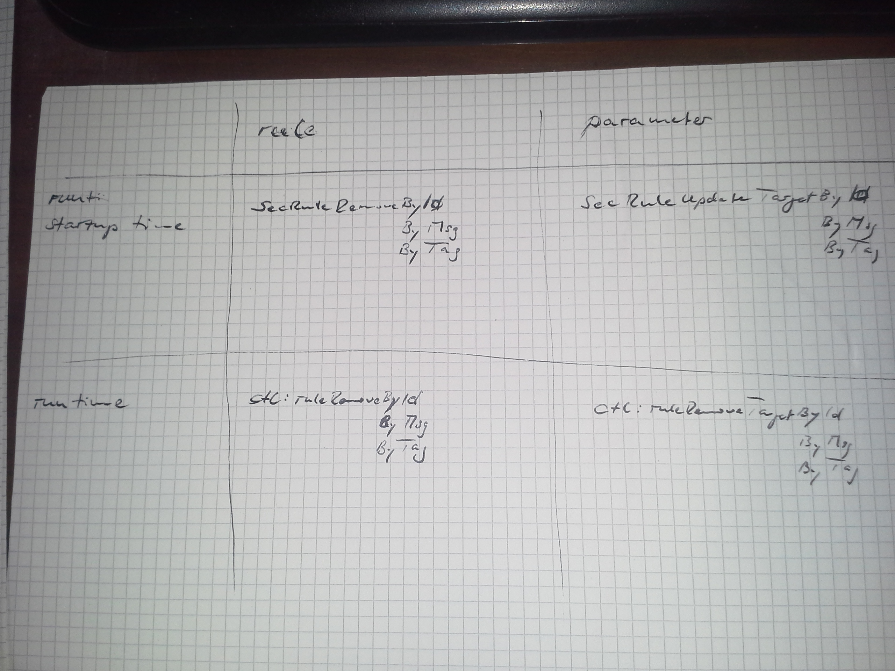

##Tutorial 7 - Including OWASP ModSecurity Core Rules

###What are we doing?

We are embedding the OWASP ModSecurity Core Rule Set in our Apache web server and eliminating false alarms.

###Why are we doing this?

The ModSecurity Web Application Firewall, as we set up in Tutorial 6, still has barely any rules. The protection only works when you configure an additional rule set that is as comprehensive as possible and when you have eliminated all of the false alarms. The Core Rules provide generic blacklisting. This means that they inspect requests and responses for signs of attacks. The signs are often keywords or typical patterns that may be suggestive of a wide variety of attacks. This also entails false alarms being triggered and we have to eliminate these for a successful installation.

###Requirements

* An Apache web server, ideally one created using the file structure shown in [Tutorial 1 (Compiling an Apache web server)](https://www.netnea.com/cms/apache_tutorial_1_apache_compilieren/).
* Understanding of the minimal configuration from [Tutorial 2 (Configuring a minimal Apache server)](https://www.netnea.com/cms/apache_tutorial_2_apache_minimal_konfigurieren/).
* An Apache web server with SSL/TLS support as shown in [Tutorial 4 (Configuring an SSL server)](https://www.netnea.com/cms/apache-tutorial-4-ssl-server-konfigurieren)
* An Apache web server with extended access log as shown in [Tutorial 5 (Extending and analyzing the access log)](https://www.netnea.com/cms/apache-tutorial-5-zugriffslog-ausbauen/)
* An Apache web server with ModSecurity as shown in [Tutorial 6 (Embedding ModSecurity)](https://www.netnea.com/cms/apache-tutorial-6-modsecurity-einbinden/)

We will be working with the new major release of the Core Rules, CRS3; short for Core Rule Set 3.0. The official distribution comes with an _INSTALL_ file that does a good job explaining the setup (after all, yours truly wrote a good deal of that file), but we will tweak the process a bit to suit our needs.

###Step 1: Downloading OWASP ModSecurity Core Rules

The ModSecurity Core Rules are being developed under the umbrella of *OWASP*, the Open Web Application Security Project. The rules themselves are available on *GitHub* and can be downloaded as follows:

```
$> cd /apache/conf
$> wget https://github.com/SpiderLabs/owasp-modsecurity-crs/archive/v3.0.0-rc2.tar.gz
$> tar xvzf v3.0.0-rc2.tar.gz
owasp-modsecurity-crs-3.0.0-rc2/
owasp-modsecurity-crs-3.0.0-rc2/CHANGES
owasp-modsecurity-crs-3.0.0-rc2/IDNUMBERING
owasp-modsecurity-crs-3.0.0-rc2/INSTALL
owasp-modsecurity-crs-3.0.0-rc2/KNOWN_BUGS
owasp-modsecurity-crs-3.0.0-rc2/LICENSE
owasp-modsecurity-crs-3.0.0-rc2/README.md
owasp-modsecurity-crs-3.0.0-rc2/crs-setup.conf.example
owasp-modsecurity-crs-3.0.0-rc2/documentation/
owasp-modsecurity-crs-3.0.0-rc2/documentation/OWASP-CRS-Documentation/
owasp-modsecurity-crs-3.0.0-rc2/documentation/README
...
$> sudo ln -s owasp-modsecurity-crs-3.0.0-rc2 /apache/conf/crs
$> cp crs/crs-setup.conf.example crs/crs-setup.conf
$> rm v3.0.0-rc2.tar.gz
```

This unpacks the base part of the Core Rules in the directory `/apache/conf/owasp-modsecurity-crs-3.0.0-rc2`. We create a link from `/apache/conf/crs` to this folder. Then we copy a file named `crs-setup.conf.example` to a new file `crs-setup.conf` and finally, we delete the Core Rules tar file.

The setup file allows us to tweak many different settings. It is worth a look - if only to see what is included. However, we are OK with the default settings and will not touch the file: We just make sure it is available under the new filename `crs-setup.conf`. Then we can continue to update the configuration to include the rules files.


###Step 2: Embedding Core Rules

In Tutorial 6, in which we embedded ModSecurity itself, we marked out a section for the Core Rules. We now add two *Include* directives into this section. Specifically, four parts are added to the existing configuration. (1) The Core Rules base configuration, (2) a part for self-defined rule exclusions before the Core Rules. Then (3) the Core Rules themselves and finally a part (4) for rule exclusions after the Core Rules.

The rule exclusions are directives and rules used for managing the false alarms described above. Some false alarms must be prevented before the corresponding Core Rule is loaded. Some false alarms can only be intercepted following the definition of the core rule itself. But one thing at a time. Here is the new block of configuration which we will insert into the base configuration we assembled when we enabled ModSecurity:

```bash
# === ModSec Core Rules Base Configuration (ids: 900000-900999)

Include    /apache/conf/crs/crs-setup.conf

SecAction "id:900110,phase:1,pass,nolog,\
  setvar:tx.inbound_anomaly_score_threshold=1000,\
  setvar:tx.outbound_anomaly_score_threshold=1000"

SecAction "id:900000,phase:1,pass,nolog,\
  setvar:tx.paranoia_level=1"


# === ModSec Core Rules: Runtime Exclusion Rules (ids: 10000-49999)

# ...


# === ModSecurity Core Rules Inclusion

Include    /apache/conf/crs/rules/*.conf


# === ModSec Core Rules: Config Time Exclusion Rules (no ids)

# ...

```

The Core Rules come with a base configuration file named `crs-setup.conf` which we prepared during the installation. Copying the original example file guarantees that we can update the Core Rules distribution without harming our copy of the config file unless we want to. 

We have the option to edit settings in that base configuration file. However, the strategy for this series of tutorials has been to define all the important things in our single Apache configuration file. We do not want to insert the complete contents of the `crs-setup.conf` file into our configuration (but we include it) in order to get the minimal set of configuration items needed to run the Core Rules. I do not want to dive into all the options in the settings file, but it is worth having a look at.

For now, we leave the file untouched, but we take three important values out of `crs-setup.conf` and define them in our config so we have them in sight at all times. We define two thresholds in the unconditional rule _900110_: The inbound anomaly score and the outbound anomaly score. This is done via the `setvar` action which sets both values to 1000.

What does that mean? The Core Rules work with a scoring mechanism by default. For every rule a request violates, there is a score being raised. When all the request rules have passed, the score is compared to the limit. If if hits the limit, the request is blocked. The same thing happens with the responses, where we want to avoid information leaks to the client.

The Core Rules come in blocking mode by default. If a rule is violated and the score hits the limit, the blocking will be effective immediately. But we are not yet sure our service runs smoothly and the danger of false alarms is always there. We want to avoid unwanted blocks, so we set the threshold at a value of 1000. Rule violations score 5 points at most, so even if cumulation is possible, a request is unlikely to hit the limit. Yet, we remain in blocking mode and when we grow more confident in our configuration, we can lower the threshold gradually.

The second rule, id `900000`, defines the _Paranoia Level_ to 1. The Core Rules are divided in four groups at paranoia levels 1 - 4. As the name suggests, the higher the paranoia level, the more paranoid the rules. The default is paranoia level 1, where the rules are quite sane and false alarms are rare. When you raise the PL to 2, additional rules are enabled. Starting with PL 2, you will face more and more false alarms, also called false positives. This number grows with PL3 and when you arrive at PL4, you are likely to face false alarms as though your web application firewall has become quite paranoid, so to speak. We will deal with false positives later in this tutorial, but for the moment you just need to be aware that you can control the aggressiveness of the rule set with the paranoia level setting.

The center of the previous config snippet follows the include statement, which loads all files with suffix `.conf` from the rules sub folder in the CRS directory. This is where all the rules are being loaded. Let's take a look at them:

```bash
$> ls -1
crs/rules/REQUEST-901-INITIALIZATION.conf
crs/rules/REQUEST-903.9001-DRUPAL-EXCLUSION-RULES.conf
crs/rules/REQUEST-903.9002-WORDPRESS-EXCLUSION-RULES.conf
crs/rules/REQUEST-905-COMMON-EXCEPTIONS.conf
crs/rules/REQUEST-910-IP-REPUTATION.conf
crs/rules/REQUEST-911-METHOD-ENFORCEMENT.conf
crs/rules/REQUEST-912-DOS-PROTECTION.conf
crs/rules/REQUEST-913-SCANNER-DETECTION.conf
crs/rules/REQUEST-920-PROTOCOL-ENFORCEMENT.conf
crs/rules/REQUEST-921-PROTOCOL-ATTACK.conf
crs/rules/REQUEST-930-APPLICATION-ATTACK-LFI.conf
crs/rules/REQUEST-931-APPLICATION-ATTACK-RFI.conf
crs/rules/REQUEST-932-APPLICATION-ATTACK-RCE.conf
crs/rules/REQUEST-933-APPLICATION-ATTACK-PHP.conf
crs/rules/REQUEST-941-APPLICATION-ATTACK-XSS.conf
crs/rules/REQUEST-942-APPLICATION-ATTACK-SQLI.conf
crs/rules/REQUEST-943-APPLICATION-ATTACK-SESSION-FIXATION.conf
crs/rules/REQUEST-949-BLOCKING-EVALUATION.conf
crs/rules/RESPONSE-950-DATA-LEAKAGES.conf
crs/rules/RESPONSE-951-DATA-LEAKAGES-SQL.conf
crs/rules/RESPONSE-952-DATA-LEAKAGES-JAVA.conf
crs/rules/RESPONSE-953-DATA-LEAKAGES-PHP.conf
crs/rules/RESPONSE-954-DATA-LEAKAGES-IIS.conf
crs/rules/RESPONSE-959-BLOCKING-EVALUATION.conf
crs/rules/RESPONSE-980-CORRELATION.conf
```

The rule files are grouped by request and response rules. We start off with an initialization rule file. There are a lot of things commented out in the `crs-setup.conf` file. These values are simply set to their default value in the 901 rule file. This helps keep the config neat and tidy and still have all default settings applied. Then we have two application specific rule files for Wordpress and Drupal, followed by an exceptions file that is mostly irrelevant to us. Starting with 910, we have the real rules.

Every file is dedicated to a topic or type of attack. The Core Rules occupy the ID namespace from 900,000 to 999,999. The first three digits of every rule correspond to three digits in the rule files. This means the IP reputation rules in `REQUEST-910-IP-REPUTATION.conf` will occupy the rule range 910,000 - 910,999. The method enforcement rules follow between 911,000 and 911,999, etc.. Some of these rule files are small and they do not use up their assigned rule range by far. Others are much bigger and the infamous SQL Injection rules run the risk of touching their ID ceiling one day.

An important rule file is `REQUEST-949-BLOCKING-EVALUATION.conf`. This is where the anomaly score is checked against the inbound threshold and the request is blocked accordingly.
Then begins the outbound rules, which are less numerous and basically check for code leakages (stack traces!) and leakages in error messages (which are very helpful if constructing and SQL injection). The outbound score is checked in the file with the 980 prefix.

Some of the rules come with data files. These files have a `.data` extension and reside in the same folder with the rule files. Data files are typically used when the request has to be checked against a long list of keywords, like unwanted user agents or php function names. Have a look if you are interested.

Before and after the rules *Include* directive in our Apache configuration file, there is a bit of configuration space reserved. This is where we will be handling false alarms in the future. Some of them are being treated before the rules are loaded in the configuration, some after the *Include* directive. We'll return to this later in this tutorial.

For completeness, here is the complete Apache configuration including ModSecurity, the Core Rules and all the other config bits from the earlier tutorials that we depend on:

```bash
ServerName        localhost
ServerAdmin       root@localhost
ServerRoot        /apache
User              www-data
Group             www-data
PidFile           logs/httpd.pid

ServerTokens      Prod
UseCanonicalName  On
TraceEnable       Off

Timeout           10
MaxClients        100

Listen            127.0.0.1:80
Listen            127.0.0.1:443

LoadModule        mpm_event_module        modules/mod_mpm_event.so
LoadModule        unixd_module            modules/mod_unixd.so

LoadModule        log_config_module       modules/mod_log_config.so
LoadModule        logio_module            modules/mod_logio.so

LoadModule        authn_core_module       modules/mod_authn_core.so
LoadModule        authz_core_module       modules/mod_authz_core.so

LoadModule        ssl_module              modules/mod_ssl.so

LoadModule        unique_id_module        modules/mod_unique_id.so
LoadModule        security2_module        modules/mod_security2.so

ErrorLogFormat          "[%{cu}t] [%-m:%-l] %-a %-L %M"
LogFormat "%h %{GEOIP_COUNTRY_CODE}e %u [%{%Y-%m-%d %H:%M:%S}t.%{usec_frac}t] \"%r\" %>s %b \
\"%{Referer}i\" \"%{User-Agent}i\" %v %A %p %R %{BALANCER_WORKER_ROUTE}e %X \"%{cookie}n\" \
%{UNIQUE_ID}e %{SSL_PROTOCOL}x %{SSL_CIPHER}x %I %O %{ratio}n%% \
%D %{ModSecTimeIn}e %{ApplicationTime}e %{ModSecTimeOut}e \
%{ModSecAnomalyScoreIn}e %{ModSecAnomalyScoreOut}e" extended

LogFormat "[%{%Y-%m-%d %H:%M:%S}t.%{usec_frac}t] %{UNIQUE_ID}e %D \
PerfModSecInbound: %{TX.perf_modsecinbound}M \
PerfAppl: %{TX.perf_application}M \
PerfModSecOutbound: %{TX.perf_modsecoutbound}M \
TS-Phase1: %{TX.ModSecTimestamp1start}M-%{TX.ModSecTimestamp1end}M \
TS-Phase2: %{TX.ModSecTimestamp2start}M-%{TX.ModSecTimestamp2end}M \
TS-Phase3: %{TX.ModSecTimestamp3start}M-%{TX.ModSecTimestamp3end}M \
TS-Phase4: %{TX.ModSecTimestamp4start}M-%{TX.ModSecTimestamp4end}M \
TS-Phase5: %{TX.ModSecTimestamp5start}M-%{TX.ModSecTimestamp5end}M \
Perf-Phase1: %{PERF_PHASE1}M \
Perf-Phase2: %{PERF_PHASE2}M \
Perf-Phase3: %{PERF_PHASE3}M \
Perf-Phase4: %{PERF_PHASE4}M \
Perf-Phase5: %{PERF_PHASE5}M \
Perf-ReadingStorage: %{PERF_SREAD}M \
Perf-WritingStorage: %{PERF_SWRITE}M \
Perf-GarbageCollection: %{PERF_GC}M \
Perf-ModSecLogging: %{PERF_LOGGING}M \
Perf-ModSecCombined: %{PERF_COMBINED}M" perflog

LogLevel                      debug
ErrorLog                      logs/error.log
CustomLog                     logs/access.log extended
CustomLog                     logs/modsec-perf.log perflog env=write_perflog

# == ModSec Base Configuration

SecRuleEngine                 On

SecRequestBodyAccess          On
SecRequestBodyLimit           10000000
SecRequestBodyNoFilesLimit    64000

SecResponseBodyAccess         On
SecResponseBodyLimit          10000000

SecPcreMatchLimit             15000
SecPcreMatchLimitRecursion    15000

SecTmpDir                     /tmp/
SecDataDir                    /tmp/
SecUploadDir                  /tmp/

SecDebugLog                   /apache/logs/modsec_debug.log
SecDebugLogLevel              0

SecAuditEngine                RelevantOnly
SecAuditLogRelevantStatus     "^(?:5|4(?!04))"
SecAuditLogParts              ABIJEFHKZ

SecAuditLogType               Concurrent
SecAuditLog                   /apache/logs/modsec_audit.log
SecAuditLogStorageDir         /apache/logs/audit/

SecDefaultAction              "phase:1,pass,log,tag:'Local Lab Service'"


# == ModSec Rule ID Namespace Definition
# Service-specific before Core-Rules:    10000 -  49999
# Service-specific after Core-Rules:     50000 -  79999
# Locally shared rules:                  80000 -  99999
#  - Performance:                        90000 -  90199
# Recommended ModSec Rules (few):       200000 - 200010
# OWASP Core-Rules:                     900000 - 999999


# === ModSec timestamps at the start of each phase (ids: 90000 - 90009)

SecAction "id:'90000',phase:1,nolog,pass,setvar:TX.ModSecTimestamp1start=%{DURATION}"
SecAction "id:'90001',phase:2,nolog,pass,setvar:TX.ModSecTimestamp2start=%{DURATION}"
SecAction "id:'90002',phase:3,nolog,pass,setvar:TX.ModSecTimestamp3start=%{DURATION}"
SecAction "id:'90003',phase:4,nolog,pass,setvar:TX.ModSecTimestamp4start=%{DURATION}"
SecAction "id:'90004',phase:5,nolog,pass,setvar:TX.ModSecTimestamp5start=%{DURATION}"
                      
# SecRule REQUEST_FILENAME "@beginsWith /" "id:'90005',phase:5,t:none,nolog,noauditlog,pass,\
# setenv:write_perflog"


# === ModSec Recommended Rules (in modsec src package) (ids: 200000-200010)

SecRule REQUEST_HEADERS:Content-Type "text/xml" \
  "id:'200000',phase:1,t:none,t:lowercase,pass,nolog,ctl:requestBodyProcessor=XML"

SecRule REQBODY_ERROR "!@eq 0" \
  "id:'200001',phase:2,t:none,deny,status:400,log,msg:'Failed to parse request body.',\
  logdata:'%{reqbody_error_msg}',severity:2"

SecRule MULTIPART_STRICT_ERROR "!@eq 0" \
"id:'200002',phase:2,t:none,log,deny,status:403, \
msg:'Multipart request body failed strict validation: \
PE %{REQBODY_PROCESSOR_ERROR}, \
BQ %{MULTIPART_BOUNDARY_QUOTED}, \
BW %{MULTIPART_BOUNDARY_WHITESPACE}, \
DB %{MULTIPART_DATA_BEFORE}, \
DA %{MULTIPART_DATA_AFTER}, \
HF %{MULTIPART_HEADER_FOLDING}, \
LF %{MULTIPART_LF_LINE}, \
SM %{MULTIPART_MISSING_SEMICOLON}, \
IQ %{MULTIPART_INVALID_QUOTING}, \
IP %{MULTIPART_INVALID_PART}, \
IH %{MULTIPART_INVALID_HEADER_FOLDING}, \
FL %{MULTIPART_FILE_LIMIT_EXCEEDED}'"

SecRule TX:/^MSC_/ "!@streq 0" \
  "ID:'200004',phase:2,t:none,deny,status:500,\
  msg:'ModSecurity internal error flagged: %{MATCHED_VAR_NAME}'"


# === ModSec Core Rules Base Configuration (ids: 900000-900999)

Include    /apache/conf/crs/crs-setup.conf

SecAction "id:900110,phase:1,pass,nolog,\
  setvar:tx.inbound_anomaly_score_threshold=1000,\
  setvar:tx.outbound_anomaly_score_threshold=1000"

SecAction "id:900000,phase:1,pass,nolog,\
  setvar:tx.paranoia_level=1"


# === ModSec Core Rules: Runtime Exclusion Rules (ids: 10000-49999)

# ...


# === ModSecurity Core Rules Inclusion

Include    /apache/conf/crs/rules/*.conf


# === ModSec Core Rules: Config Time Exclusion Rules (no ids)

# ...


# === ModSec Timestamps at the End of Each Phase (ids: 90010 - 90019)

SecAction "id:'90010',phase:1,pass,nolog,setvar:TX.ModSecTimestamp1end=%{DURATION}"
SecAction "id:'90011',phase:2,pass,nolog,setvar:TX.ModSecTimestamp2end=%{DURATION}"
SecAction "id:'90012',phase:3,pass,nolog,setvar:TX.ModSecTimestamp3end=%{DURATION}"
SecAction "id:'90013',phase:4,pass,nolog,setvar:TX.ModSecTimestamp4end=%{DURATION}"
SecAction "id:'90014',phase:5,pass,nolog,setvar:TX.ModSecTimestamp5end=%{DURATION}"


# === ModSec performance calculations and variable export (ids: 90100 - 90199)

SecAction "id:90100,phase:5,pass,nolog,\
  setvar:TX.perf_modsecinbound=%{PERF_PHASE1},\
  setvar:TX.perf_modsecinbound=+%{PERF_PHASE2},\
  setvar:TX.perf_application=%{TX.ModSecTimestamp3start},\
  setvar:TX.perf_application=-%{TX.ModSecTimestamp2end},\
  setvar:TX.perf_modsecoutbound=%{PERF_PHASE3},\
  setvar:TX.perf_modsecoutbound=+%{PERF_PHASE4},\
  setenv:ModSecTimeIn=%{TX.perf_modsecinbound},\
  setenv:ApplicationTime=%{TX.perf_application},\
  setenv:ModSecTimeOut=%{TX.perf_modsecoutbound},\
  setenv:ModSecAnomalyScoreIn=%{TX.anomaly_score},\
  setenv:ModSecAnomalyScoreOut=%{TX.outbound_anomaly_score}"

SSLCertificateKeyFile   /etc/ssl/private/ssl-cert-snakeoil.key
SSLCertificateFile      /etc/ssl/certs/ssl-cert-snakeoil.pem

SSLProtocol             All -SSLv2 -SSLv3
SSLCipherSuite          'kEECDH+ECDSA kEECDH kEDH HIGH +SHA !aNULL !eNULL !LOW !MEDIUM !MD5 !EXP !DSS \
!PSK !SRP !kECDH !CAMELLIA !RC4'
SSLHonorCipherOrder     On

SSLRandomSeed           startup file:/dev/urandom 2048
SSLRandomSeed           connect builtin

DocumentRoot		/apache/htdocs

<Directory />
      
	Require all denied

	Options SymLinksIfOwnerMatch
	AllowOverride None

</Directory>

<VirtualHost 127.0.0.1:80>
      
      <Directory /apache/htdocs>

        Require all granted

        Options None
        AllowOverride None

      </Directory>

</VirtualHost>

<VirtualHost 127.0.0.1:443>
    
      SSLEngine On

      <Directory /apache/htdocs>

              Require all granted

              Options None
              AllowOverride None

      </Directory>

</VirtualHost>

```

We have embedded the Core Rules and are now ready for a test operation. The rules inspect requests and responses. They will trigger alarms if they encounter fishy requests, but they will not block any transaction, because the limits have been set very high. Let's give it a shot.

###Step 3: Triggering alarms for testing purposes

For starters, we will do something easy. It is a request that will trigger exactly one rule by attempting to execute a bash shell. We know that our simple lab server is not vulnerable to such a blatant attack, but ModSecurity does not know this and will still try to protect us:

```bash
$> curl localhost/index.html?exec=/bin/bash
<html><body><h1>It works!</h1></body></html>
```
As predicted, we have not been blocked, but let's check the logs to see if anything happened:

```bash
$> tail -1 /apache/logs/access.log
127.0.0.1 - - [2016-10-25 08:40:01.881647] "GET /index.html?exec=/bin/bash HTTP/1.1" 200 48 "-" "curl/7.35.0" localhost 127.0.0.1 40080 - - + "-" WA7@QX8AAQEAABC4maIAAAAV - - 98 234 -% 7672 2569 117 479 5 0
```

It looks like a standard `GET` request with a status 200. The interesting bit is the second field from the end. In the log file tutorial, we defined a lengthy Apache access log format with two items reserved for the anomaly score. So far, these values have been empty; now they are being filled. The first of the two numbers at the end is the request's inbound anomaly score. Our submission of `/bin/bash` as parameter got us a score of 5. This is considered a critical rule violation by the Core Rules. An error level violation is set at 4, a warning at 3 and a notice at 2. However, if you look over the rules in all the files, most of them score as critical violations with a score of 5.

But now we want to know what rule triggered the alert. We could simply tail the error log, but let's use the unique ID to get all the messages associated with our request. The unique ID was displayed in the access log, so this is very simple:

```bash
[2016-10-25 08:40:01.881938] [authz_core:debug] 127.0.0.1:42732 WA7@QX8AAQEAABC4maIAAAAV AH01626: authorization result of Require all granted: granted
[2016-10-25 08:40:01.882000] [authz_core:debug] 127.0.0.1:42732 WA7@QX8AAQEAABC4maIAAAAV AH01626: authorization result of <RequireAny>: granted
[2016-10-25 08:40:01.884172] [-:error] 127.0.0.1:42732 WA7@QX8AAQEAABC4maIAAAAV [client 127.0.0.1] ModSecurity: Warning. Matched phrase "/bin/bash" at ARGS:exec. [file "/apache/conf/crs/rules/REQUEST-932-APPLICATION-ATTACK-RCE.conf"] [line "448"] [id "932160"] [rev "1"] [msg "Remote Command Execution: Unix Shell Code Found"] [data "Matched Data: /bin/bash found within ARGS:exec: /bin/bash"] [severity "CRITICAL"] [ver "OWASP_CRS/3.0.0"] [maturity "1"] [accuracy "8"] [tag "application-multi"] [tag "language-shell"] [tag "platform-unix"] [tag "attack-rce"] [tag "OWASP_CRS/WEB_ATTACK/COMMAND_INJECTION"] [tag "WASCTC/WASC-31"] [tag "OWASP_TOP_10/A1"] [tag "PCI/6.5.2"] [hostname "localhost"] [uri "/index.html"] [unique_id "WA7@QX8AAQEAABC4maIAAAAV"]
```

The authorization modules report twice in the log file since we are running on level debug. But on the third line, we see the rule alert we are looking for. Let's look at this in detail. The Core Rules messages contain much more information than normal Apache messages, making it worthwhile to discuss the log format once more.

The beginning of the line consists of the Apache-specific parts such as the timestamp and the severity of the message as the Apache server sees it. *ModSecurity* messages are always set to *error* level. ModSecurity's alert format and the Apache error log format we configured lead to some redundancy. The first occurrence client IP address with the source port number and the unique ID of the request are fields written by Apache. The square bracket with the same client IP address again marks the beginning of ModSecurity's alert message. The characteristic marker of a Core Rules alert is `ModSecurity: Warning`. It describes a rule being triggered without blocking the request. This is because the alert only raised the anomaly score. It is very easy to distinguish between the issuing of alarms and actual blocking in the Apache error log. Particularly since the individual Core Rules increase the anomaly score, but they do not trigger a blockade. The blockade itself is performed by a separate blocking rule taking the limit into account. But given the insanely high limit, this is not expected to appear anytime soon. ModSecurity logs normal rule violations in the error log as *ModSecurity. Warning ...*, and blockades will be logged as *ModSecurity. Access denied ...*. A *warning* never has any direct impact on the client: Unless you see the *Access denied ...*, the client was unaffected.

What comes next? A reference to the pattern found in the request. The specific phrase `/bin/bash` was found in the argument `exec`. Then comes a series of information chunks that always have the same pattern: They are within square brackets and have their own identifier. First you'll see the *file* identifier. It shows us the file in which the rule that triggered the alarm is defined. This is followed by *line* for the line number within the file. The *id* parameter is an important one. The rule in question, `932160`, can be found in the set of rules that defend against remote command execution in the 932,000 - 932,999 rule block. Then comes *rev* as a reference to the revision number of the rule. In Core Rules, this parameter expresses how often the rule has been revised. If a modification is made to a rule, *rev* increases by one. *msg*, short for *message*, describes the type of attack detected. The relevant part of the request, the *exec* parameter appears in *data*. In my example, this is obviously a case of *Remote Code Execution* (RCE).

Then we have the *severity* level of the rule that set off the alarm and corresponds with the anomaly score of the rule. We have already established the fact that our rule is considered critical, that's why it is being reported here at this severity. At *ver*, we come to the release of the core rule set, followed by *maturity*, a reference to the quality of the rule. Higher *maturity* indicates that we can trust this rule, because it is in widespread use and has caused very few problems. However, low *maturity* is likely to indicate an experimental rule. This is why the value 1 appears only six times in the *Core Rules*, whereas in the version being used, 116 rules have a value of 8 and 99 rules are assumed to have a maturity of 9. *Accuracy*, the precision of the rule, behaves similarly to *maturity*. This is an optional value the author of the rule defined when writing the rule. There are no low values in the system of rules, 8 is the most frequent value (144 times), 9 is widespread (82). All these additional notes in the log message are for documentation purposes only. In my experience, they are of little relevance and hardly ever change between *Core Rules* releases. This might change in the future, though.

What follows is a series of *tags* assigned to the rule. They are included along with every alert message. These tags often classify the type of attack. These references can, for example, be used for analysis and statistics. Towards the end of the alarm comes three additional values, *hostname*, *uri* and *unique_id*, that more clearly specify the request (the *unique_id* was already listed early on the log line by Apache itself, so repeating it here is somewhat redundant). 

With this, we have covered the full alert message that led to the inbound anomaly score of 5. That was only a single request with a single alert. Let's generate more alerts. *Nikto* is a simple tool that can help us in this situation. It's a security scanner that has been around for ages. It's not very proficient, but it is fast and easy to use. Just the right tool to generate alerts for us. *Nikto* may still have to be installed. The scanner is, however, included in most distributions.

```bash
$> nikto -h localhost
- Nikto v2.1.4
---------------------------------------------------------------------------
+ Target IP:          127.0.0.1
+ Target Hostname:    localhost
+ Target Port:        80
+ Start Time:         2016-10-26 10:07:07
---------------------------------------------------------------------------
+ Server: Apache
+ No CGI Directories found (use '-C all' to force check all possible dirs)
+ ETag header found on server, fields: 0x30 0x53ab921464f15 
+ Allowed HTTP Methods: GET, HEAD, POST, OPTIONS 
+ /login.php: Admin login page/section found.
+ 6448 items checked: 0 error(s) and 3 item(s) reported on remote host
+ End Time:           2016-10-26 10:07:57 (50 seconds)
---------------------------------------------------------------------------
+ 1 host(s) tested
```

This scan should have triggered numerous *ModSecurity alarms* on the server. Let’s take a close look at the *Apache error log*. In my case, there were over 7,300 entries in the error log. Combine this with the authorization messages and infos on many 404s (Nikto probes for files that do not exist on the server) and you end up with a fast-growing error log. The single Nikto run resulted in an 8.8 MB logfile. Looking over the audit log tree reveals 78 MB of logs. It's obvious: you need to keep a close eye on these log files or your server will collapse due to denial of service via log file exhaustion.

###Step 4: Analyzing anomaly scores

So we are looking at 7,300 alerts. And even if the format of the entries in the error log may be clear, without a tool they are very hard to read, let alone analyze. A simple remedy is to use a few *shell aliases*, which extract individual pieces of information from the entries. They are stored in the alias file we discussed in the log format in Tutorial 5.

```
$> cat ~/.apache-modsec.alias
...
alias meldata='grep -o "\[data [^]]*" | cut -d\" -f2'
alias melfile='grep -o "\[file [^]]*" | cut -d\" -f2'
alias melhostname='grep -o "\[hostname [^]]*" | cut -d\" -f2'
alias melid='grep -o "\[id [^]]*" | cut -d\" -f2'
alias melip='grep -o "\[client [^]]*" | cut -b9-'
alias melline='grep -o "\[line [^]]*" | cut -d\" -f2'
alias melmatch='grep -o " at [^\ ]*\. \[file" | sed -e "s/\. \[file//" | cut -b5-'
alias melmsg='grep -o "\[msg [^]]*" | cut -d\" -f2'
alias meltimestamp='cut -b2-25'
alias melunique_id='grep -o "\[unique_id [^]]*" | cut -d\" -f2'
alias meluri='grep -o "\[uri [^]]*" | cut -d\" -f2'
...
$> source ~/.apache-modsec.alias 
```

These abbreviations all start with the prefix *mel*, short for *ModSecurity error log*, followed by the field name. Let’s try it out to output the rule IDs from the messages:

```
$> cat logs/error.log | melid | tail
941160
920440
920440
911100
920100
930100
930110
930110
930120
932160
```

This seems to do the job. So let’s extend the example a few steps:

```
$> cat logs/error.log | melid | sort | uniq -c | sort -n
      1 920220
      1 920290
      1 921150
      1 932115
      2 920280
      2 941140
      3 942270
      4 920420
      4 933150
      6 932110
      9 911100
     11 920100
     12 942100
     13 920430
     13 932100
     13 932105
     15 941170
     15 941210
     17 920170
     35 932150
     67 933130
     70 933160
    115 941180
    136 920270
    139 932160
    141 931110
    191 930100
    219 920440
    219 930120
    246 941110
    248 941100
    249 941160
    531 930110
   2274 931120
   2340 913120
$> cat logs/error.log | melid | sort | uniq -c | sort -n | while read STR; do echo -n "$STR "; \
ID=$(echo "$STR" | sed -e "s/.*\ //"); grep $ID logs/error.log | head -1 | melmsg; done
1 920220 URL Encoding Abuse Attack Attempt
1 920290 Empty Host Header
1 921150 HTTP Header Injection Attack via payload (CR/LF deteced)
1 932115 Remote Command Execution: Windows Command Injection
2 920280 Request Missing a Host Header
2 941140 XSS Filter - Category 4: Javascript URI Vector
3 942270 Looking for basic sql injection. Common attack string for mysql, oracle and others.
4 920420 Request content type is not allowed by policy
4 933150 PHP Injection Attack: High-Risk PHP Function Name Found
6 932110 Remote Command Execution: Windows Command Injection
9 911100 Method is not allowed by policy
11 920100 Invalid HTTP Request Line
12 942100 SQL Injection Attack Detected via libinjection
13 920430 HTTP protocol version is not allowed by policy
13 932100 Remote Command Execution: Unix Command Injection
13 932105 Remote Command Execution: Unix Command Injection
15 941170 NoScript XSS InjectionChecker: Attribute Injection
15 941210 IE XSS Filters - Attack Detected.
17 920170 GET or HEAD Request with Body Content.
35 932150 Remote Command Execution: Direct Unix Command Execution
67 933130 PHP Injection Attack: Variables Found
70 933160 PHP Injection Attack: High-Risk PHP Function Call Found
115 941180 Node-Validator Blacklist Keywords
136 920270 Invalid character in request (null character)
139 932160 Remote Command Execution: Unix Shell Code Found
141 931110 Possible Remote File Inclusion (RFI) Attack: Common RFI Vulnerable Parameter Name used w/URL Payload
191 930100 Path Traversal Attack (/../)
219 920440 URL file extension is restricted by policy
219 930120 OS File Access Attempt
246 941110 XSS Filter - Category 1: Script Tag Vector
248 941100 XSS Attack Detected via libinjection
249 941160 NoScript XSS InjectionChecker: HTML Injection
531 930110 Path Traversal Attack (/../)
2274 931120 Possible Remote File Inclusion (RFI) Attack: URL Payload Used w/Trailing Question Mark Character (?)
2340 913120 Found request filename/argument associated with security scanner
```

This, we can work with. But it’s perhaps necessary to explain the *one-liners*. We extract the rule IDs from the *error log*, then *sort* them, sum them together in a list of found IDs (*uniq -c*) and sort again by the numbers found. That’s the first *one-liner*. A relationship between the individual rules is still lacking, because there’s not much we can do with the ID number yet. We get the names from the *error log* again by looking through the previously run test line-by-line in a loop. We show what we have in this loop (`$STR`). Then we have to separate the number of found items and the IDs again. This is done using an embedded sub-command (`ID=$(echo "$STR" | sed -e "s/.*\ //")`). We then use the IDs we just found to search the *error log* once more for an entry, but take only the first one, extract the *msg* part and display it. Done.

You might now think that it would be better to define an additional alias to determine the ID and description of the rule in a single step. This puts us on the wrong path, though, because there are rules that contain dynamic parts in and following the brackets (anomaly scores in the rules checking the threshold with rule ID 949110 and 980130!). We, of course, want to combine these rules, putting them together in order to map the rule only once. So, to really simplify analysis, we have to get rid of the dynamic items. Here’s an additional *alias*, that is also part of the *.apache-modsec.alias* file, that implements this idea: 

```bash
alias melidmsg='grep -o "\[id [^]]*\].*\[msg [^]]*\]" | sed -e "s/\].*\[/] [/" -e "s/\[msg //" | \
cut -d\  -f2- | tr -d "\]\"" | sed -e "s/(Total .*/(Total ...) .../"'
```

```bash
$> cat logs/error.log | melidmsg | sucs
      1 920220 URL Encoding Abuse Attack Attempt
      1 920290 Empty Host Header
      1 921150 HTTP Header Injection Attack via payload (CR/LF deteced)
      1 932115 Remote Command Execution: Windows Command Injection
      2 920280 Request Missing a Host Header
      2 941140 XSS Filter - Category 4: Javascript URI Vector
      3 942270 Looking for basic sql injection. Common attack string for mysql, oracle and others.
      4 920420 Request content type is not allowed by policy
      4 933150 PHP Injection Attack: High-Risk PHP Function Name Found
      6 932110 Remote Command Execution: Windows Command Injection
      9 911100 Method is not allowed by policy
     11 920100 Invalid HTTP Request Line
     12 942100 SQL Injection Attack Detected via libinjection
     13 920430 HTTP protocol version is not allowed by policy
     13 932100 Remote Command Execution: Unix Command Injection
     13 932105 Remote Command Execution: Unix Command Injection
     15 941170 NoScript XSS InjectionChecker: Attribute Injection
     15 941210 IE XSS Filters - Attack Detected.
     17 920170 GET or HEAD Request with Body Content.
     35 932150 Remote Command Execution: Direct Unix Command Execution
     67 933130 PHP Injection Attack: Variables Found
     70 933160 PHP Injection Attack: High-Risk PHP Function Call Found
    115 941180 Node-Validator Blacklist Keywords
    136 920270 Invalid character in request (null character)
    139 932160 Remote Command Execution: Unix Shell Code Found
    141 931110 Possible Remote File Inclusion (RFI) Attack: Common RFI Vulnerable Parameter Name used w/URL Payload
    191 930100 Path Traversal Attack (/../)
    219 920440 URL file extension is restricted by policy
    219 930120 OS File Access Attempt
    246 941110 XSS Filter - Category 1: Script Tag Vector
    248 941100 XSS Attack Detected via libinjection
    249 941160 NoScript XSS InjectionChecker: HTML Injection
    531 930110 Path Traversal Attack (/../)
   2274 931120 Possible Remote File Inclusion (RFI) Attack: URL Payload Used w/Trailing Question Mark Character (?)
   2340 913120 Found request filename/argument associated with security scanner
```

So that's something we can work with. It shows that the Core Rules detected a lot of malicious requests and we now have an idea which rules played a role in this. The rule triggered most frequently, 913120, is no surprise, and when you look upwards in the output, this all makes a lot of sense.


###Step 5: Evaluating false alarms

So the *Nikto* scan set off thousands of alarms. They were likely justified. In the normal use of *ModSecurity*, things are a bit different. The Core Rules are designed and optimized to have as few false alarms as possible in paranoia level 1. But in production use, there are going to be false positives sooner or later. Depending on the application, a normal installation will also see alarms and a lot of them will be false. And when you raise the paranoia level to become more vigilant towards attacks, the number of false positives will also rise. Actually, it will rise steeply when you move to PL 3 or 4; so steeply, some would call it exploding.

In order to run smoothly, the configuration has to be fine tuned first. Legitimate requests and exploitation attempts need to be distinct. We want to achieve a high degree of separation between the two. We wish to configure *ModSecurity* and the CRS so the engine knows exactly how to distinguish between legitimate requests and attacks.

False alarms are possible in both directions. Attacks that are not detected are called *false negatives*. The *Core Rules* are strict and careful to keep the number of *false negatives* low. An attacker needs to possess a great deal of savvy to circumvent the system of rules, especially at higher paranoia levels. Unfortunately, this strictness also results in alarms being triggered for normal requests. It is commonly the case that at a low degree of separation, you either get a lot of *false negatives* or a lot of *false positives*. Reducing the number of *false negatives* leads to an increase in *false positives* and vice versa. Both correlate highly with one another.

We have to overcome this link: We want to increase the degree of separation in order to reduce the number of *false positives* without increasing the number of *false negatives*. We can do this by fine tuning the system of rules in a few places. We have to exclude certain rules from being executed for certain requests or parameters. But first we need to have a clear picture of the current situation: How many *false positives* are there and which of the rules are being violated in a particular context? How many *false positives* are we willing to allow on the system? Reducing them to zero will be extremely difficult to do, but percentages are something we can work with. A possible target would be: 99.99% of legitimate requests should pass without being blocked by the web application firewall. This is realistic, but involves a bit of work depending on the application. 99.99% of requests without a false alarm is also a number where professional use starts. But I have setups where we are not willing to accept more than 1 false alarm in 1 million of requests. That's 99.9999%.

To reach such a goal, we will need one or two tools to help us get a good footing. Specifically, we need to find out about these numbers. Then, in a second step, we look at the error log to understand the rules that led to these alerts. We have seen that the access log reports the anomaly scores of the requests. Let's try to extract these scores and to present them in a suitable form.

In Tutorial 5 we worked with a sample log file containing 10,000 entries. We’ll be using this log file again here: [tutorial-5-example-access.log](https://www.netnea.com/apache-tutorials/git/laboratory/tutorial-5/tutorial-5-example-access.log). The file comes from a real server, but the IP addresses, server names and paths have been simplified or rewritten. However, the information we need for our analysis is still there. Let’s have a look at the distribution of *anomaly scores*:

```
$> egrep -o "[0-9-]+ [0-9-]+$" tutorial-5-example-access.log | cut -d\  -f1 | sucs
      1 21
      2 41
      8 5
     11 2
     17 3
     41 -
   9920 0
$> egrep -o "[0-9-]+$" tutorial-5-example-access.log | sucs
     41 -
   9959 0
```

The first command line reads the inbound *anomaly score*. It’s the second-to-last value in the *access log line*. We take the two last values (*egrep*) and then *cut* the first one out. We then sort the results using the familiar *sucs* alias. The outbound *anomaly score* is the last value in the *log line*. This is why there is no *cut* command on the second command line.

The results give us an idea of the situation: The vast majority of requests pass the *ModSecurity module* with no rule violation: 9920 requests with score 0. 80 requests violated one or more rules. This is not a standard situation for the Core Rules. In fact, I provoked additional false alarms to give us something to look at. The Core Rules are so optimized these days that you need a lot of traffic to get a reasonable amount of alerts - or you need to raise the paranoia level very high on a non-tuned system.

A score of 41 appears twice, corresponding to a high number of serious rule infractions. This is very common in practice, where a serious SQL injection attempt sets off a series of alarms. In 41 cases, we didn’t get any score for the server’s responses. These are log entries of empty requests in which a connection with the client was established, but no request was made. We have taken this possibility into account in the regular expression using *egrep* and are also taking into account the default value, "-". Besides these empty entries, nothing else is conspicuous at all. This is typical, if a bit high. In all likelihood, we will be seeing a fair number of violations from the requests and very few alarms from the responses.

But this still doesn’t give us the right idea about the *tuning steps* that would be needed to run this install smoothly. To present this information in a suitable form, I have prepared a script that analyzes *anomaly scores*. [modsec-positive-stats.rb](https://www.netnea.com/apache-tutorials/git/laboratory/bin/modsec-positive-stats.rb). It takes the two anomaly scores as input and we need to separate them with a semicolon in order to pipe them into the script. We can do this like this:

```
$> cat tutorial-5-example-access.log  | egrep -o "[0-9-]+ [0-9-]+$" | tr " " ";" | modsec-positive-stats.rb
INCOMING                     Num of req. | % of req. |  Sum of % | Missing %
Number of incoming req. (total) |  10000 | 100.0000% | 100.0000% |   0.0000%

Empty or miss. incoming score   |     41 |   0.4100% |   0.4100% |  99.5900%
Reqs with incoming score of   0 |   9920 |  99.2000% |  99.6100% |   0.3900%
Reqs with incoming score of   1 |      0 |   0.0000% |  99.6100% |   0.3900%
Reqs with incoming score of   2 |     11 |   0.1100% |  99.7200% |   0.2800%
Reqs with incoming score of   3 |     17 |   0.1699% |  99.8900% |   0.1100%
Reqs with incoming score of   4 |      0 |   0.0000% |  99.8900% |   0.1100%
Reqs with incoming score of   5 |      8 |   0.0800% |  99.9700% |   0.0300%
Reqs with incoming score of   6 |      0 |   0.0000% |  99.9700% |   0.0300%
Reqs with incoming score of   7 |      0 |   0.0000% |  99.9700% |   0.0300%
Reqs with incoming score of   8 |      0 |   0.0000% |  99.9700% |   0.0300%
Reqs with incoming score of   9 |      0 |   0.0000% |  99.9700% |   0.0300%
Reqs with incoming score of  10 |      0 |   0.0000% |  99.9700% |   0.0300%
Reqs with incoming score of  11 |      0 |   0.0000% |  99.9700% |   0.0300%
Reqs with incoming score of  12 |      0 |   0.0000% |  99.9700% |   0.0300%
Reqs with incoming score of  13 |      0 |   0.0000% |  99.9700% |   0.0300%
Reqs with incoming score of  14 |      0 |   0.0000% |  99.9700% |   0.0300%
Reqs with incoming score of  15 |      0 |   0.0000% |  99.9700% |   0.0300%
Reqs with incoming score of  16 |      0 |   0.0000% |  99.9700% |   0.0300%
Reqs with incoming score of  17 |      0 |   0.0000% |  99.9700% |   0.0300%
Reqs with incoming score of  18 |      0 |   0.0000% |  99.9700% |   0.0300%
Reqs with incoming score of  19 |      0 |   0.0000% |  99.9700% |   0.0300%
Reqs with incoming score of  20 |      0 |   0.0000% |  99.9700% |   0.0300%
Reqs with incoming score of  21 |      1 |   0.0100% |  99.9800% |   0.0200%
Reqs with incoming score of  22 |      0 |   0.0000% |  99.9800% |   0.0200%
Reqs with incoming score of  23 |      0 |   0.0000% |  99.9800% |   0.0200%
Reqs with incoming score of  24 |      0 |   0.0000% |  99.9800% |   0.0200%
Reqs with incoming score of  25 |      0 |   0.0000% |  99.9800% |   0.0200%
Reqs with incoming score of  26 |      0 |   0.0000% |  99.9800% |   0.0200%
Reqs with incoming score of  27 |      0 |   0.0000% |  99.9800% |   0.0200%
Reqs with incoming score of  28 |      0 |   0.0000% |  99.9800% |   0.0200%
Reqs with incoming score of  29 |      0 |   0.0000% |  99.9800% |   0.0200%
Reqs with incoming score of  30 |      0 |   0.0000% |  99.9800% |   0.0200%
Reqs with incoming score of  31 |      0 |   0.0000% |  99.9800% |   0.0200%
Reqs with incoming score of  32 |      0 |   0.0000% |  99.9800% |   0.0200%
Reqs with incoming score of  33 |      0 |   0.0000% |  99.9800% |   0.0200%
Reqs with incoming score of  34 |      0 |   0.0000% |  99.9800% |   0.0200%
Reqs with incoming score of  35 |      0 |   0.0000% |  99.9800% |   0.0200%
Reqs with incoming score of  36 |      0 |   0.0000% |  99.9800% |   0.0200%
Reqs with incoming score of  37 |      0 |   0.0000% |  99.9800% |   0.0200%
Reqs with incoming score of  38 |      0 |   0.0000% |  99.9800% |   0.0200%
Reqs with incoming score of  39 |      0 |   0.0000% |  99.9800% |   0.0200%
Reqs with incoming score of  40 |      0 |   0.0000% |  99.9800% |   0.0200%
Reqs with incoming score of  41 |      2 |   0.0200% | 100.0000% |   0.0000%

Average:   0.0217        Median   0.0000         Standard deviation   0.6490


OUTGOING                     Num of req. | % of req. |  Sum of % | Missing %
Number of outgoing req. (total) |  10000 | 100.0000% | 100.0000% |   0.0000%

Empty or miss. incoming score   |     41 |   0.4100% |   0.4100% |  99.5900%
Reqs with outgoing score of   0 |   9959 |  99.5900% | 100.0000% |   0.0000%

Average:   0.0000        Median   0.0000         Standard deviation   0.0000
```

The script divides the inbound from the outbound *anomaly scores*. The incoming ones are handled first. Before the script can handle the scores, it describes how often an empty *anomaly score* has been found (*empty incoming score*). In our case, this was 41 times, as we saw before. Then comes the statement about *score 0*: 9920 requests. This is covering 99.2% of the requests. Together with the empty scores, this is already covering 99.61% (*Sum of %*). 0.39% had a higher *anomaly score* (*Missing %*). Above, we set out to have 99.99% of requests able to pass the server. We are about 0.38% or 38 requests away from this target. The next *anomaly score* is 2. It appears 11 times or 0.11%. The *anomaly score* 3 appears 17 times and a score of 5 can be seen 8 times. All in all, we are at 99.97%. Then there is one request with a score of 21 and finally 2 requests with with a score of 41. To achieve 99.99% coverage we have get to this limit (and, based on the log file, thus achieve 100% coverage).

There are probably some *false positives*. In practice, we have to make certain of this before we start fine tuning the rules. It would be totally wrong to assume a false positive based on a justified alarm and suppress the alarm in the future. Before tuning, we must ensure that no attacks are present in the log file. This is not always easy. Manual review helps, restricting to known IP addresses, pre-authentication, testing/tuning on a test system separated from the internet, filtering the access log by country of origin for the IP address, etc... It's a big topic and making general recommendations is difficult. But please do take this seriously.

###Step 6: Handling false positives: Disabling individual rules

The simple way of dealing with a *false positive* is to simply disable the rule. We are thus making the alarm disappear by excluding a certain rule from the rule set. The CRS term for this technique is called *Rules Exclusion* or *Exclusion Rules*. It is called *Rule* because this exclusion involved writing rules or directives resembling rules themselves.

Excluding a rule completely takes very little effort, but it is, of course, potentially risky because the rule is not being disabled for just legitimate users, but for attackers as well. By completely disabling a rule, we are restricting the capability of *ModSecurity*. Or, expressed more drastically, we’re pulling the teeth out of the *WAF*.

Especially at higher paranoia levels, there are rules that just fail to work with some applications and trigger false alarms in all sorts of situations. So there is a use for disabling a rule completely. One notable example is rule ID `920300`: *Request Missing an Accept Header*. There are just so many user agents that submit requests without an accept header, there is a rule dedicated to the problem. Let's raise the paranoia level to 2 by setting the `tx.paranoia_level` variable to 2 in rule ID 900,000.  Then we will send a request without an `Accept` header to trigger an alert as follows (I recommend returning the paranoia level to 1 again afterwards):

```bash
$> curl -v -H "Accept: " http://localhost/index.html
...
> GET /index.html HTTP/1.1
> User-Agent: curl/7.32.0
> Host: localhost
...
$> tail /apache/logs/error.log | melidmsg
920300 Request Missing an Accept Header
```

So the rule has been triggered as desired. Let us now exclude the rule. We have multiple options and we start with the simplest one: We exclude the rule at startup time for Apache. This means it removes the rule from the set of loaded rules and no processor cycles will be spent on the rule once the server has started. Of course, we can only remove things which have been loaded before. So this directive has to be placed after the CRS include statement. In the config recipe earlier in this tutorial, we reserved some space for these sorts of exclusion rules. We fill in our exclusion directive in this location:

```bash
# === ModSec Core Rules: Config Time Exclusion Rules (no ids)

# ModSec Exclusion Rule: 920300 Request Missing an Accept Header
SecRuleRemoveById 920300

```
The example comes with a comment, which describes the rule being excluded. This is a good practice, which you should adopt as well. We have the option to exclude by ID (as we just did), to add several comma separated rule IDs, to configure a rule range or we can select the rule by its message or by one of its tags. Here is an example using the message of the rule 920,300:

```bash
# ModSec Exclusion Rule: 920300 Request Missing an Accept Header
SecRuleRemoveByMsg "Request Missing an Accept Header"
```

The *SecRuleRemoveByMsg* directive can also use regular expressions as parameters. This works with the related *SecRuleRemoveByTag* directive as well:

```bash
SecRuleRemoveByTag "MISSING_HEADER_ACCEPT$"
```

Unfortunately, the support for regular expressions is not universal. For example, the *OR* functionality, expressed with a pipe character, is not implemented. In practice, you will have to try it out and see for yourself.

So these are startup rule exclusions. Excluding a rule in this manner is simple and readable, but it is also a drastic step which we will not use in a production setup very often. Because, if our issues with the rule 920300 are limited to a single legitimate agent checking the availability of our service by requesting the index page, we can limit the exclusion to this individual request. This is no longer a startup time rule exclusion, but a runtime exclusion which is being applied on certain conditions. Runtime exclusions leverage the *SecRule* directive combined with a special action executing the rule exclusion. This depends on the SecRule statement running before the rule in question is applied. That's why runtime rule exclusions have to be placed before the Core Rules include statement, where we also reserved a space for this type of exclusion rule:

```bash
# === ModSec Core Rules: Runtime Exclusion Rules (ids: 10000-49999)

# ModSec Exclusion Rule: 920300 Request Missing an Accept Header
SecRule REQUEST_FILENAME "@beginsWith /index.html" "phase:1,nolog,pass,id:10000,ctl:ruleRemoveById=920300"
```

Now this is harder to read. Watch out for the *ctl* statement: `ctl:ruleRemoveById=920300`. This is the control action, which is used for runtime changes of the configuration of the ModSecurity rule engine. We use *ruleRemoveById* as the control statement and apply it to rule ID 920300. This block is placed within a standard *SecRule* directive. This allows us to use the complete power of *SecRule* to exclude rule 920300 in very specific situations. Here we exclude it based on the path of the request, but we could apply it depending on the agent's IP address - or a combination of the two in a chained rule statement.

As with the startup rule exclusions, we are not limited to an exclusion by rule ID. Exclusions by message or tag will work just as well (`ctl:ruleRemoveByMsg`, `ctl:ruleRemoveByTag`). Again, regular expressions are supported, but only to a certain extent.

Startup time rule exclusions and runtime rule exclusions have the same effect, but internally, they are really different. With the runtime exclusions, you gain granular control at the cost of performance, as the exclusion is being evaluated for every single request. Startup time exclusions are performing better and they are easier to read and write.

###Step 7: Handling false positives: Disabling individual rules for specific parameters

Next we look at excluding an individual parameter from being evaluated by a specific rule. So unlike our example 920300, which looked at the specific Accept header, we are now targeting rules examining the ARGS group of variables.

Let's assume we have a password field in an authentication scheme like we used in the previous tutorial. Users are advised to use hard to guess passwords with lots of special characters which leads to the Core Rules sending a steady stream of alerts because of the strange password in this parameter field.

Here is an artificial example triggering the rule 942100, which leverages the libinjection library to detect SQL injections. Execute this command and you get an alert:

```bash
$> curl --data "password=' or f7x=gZs" localhost/login/login.do
```

There is little wrong with this password from a security perspective. In fact, we should just disable this rule. But of course, it would be wrong to disable this rule completely. It serves a very important purpose with many other parameters. Ideally, we want to exclude the parameter password from being examined by this rule. Here is the startup time rule exclusion performing this task:

```bash
SecRuleUpdateTargetById 942100 !ARGS:password
```

This directive adds "not ARGS:password" to the list of parameters to be examined by rule 942100. This effectively excludes the parameter from the evaluation. This directive also accepts rule ranges as parameters and it comes with two siblings for messages and tags. Of course, this directive also exists in a variant where we select the rule via its message:

```bash
SecRuleUpdateTargetByMsg "SQL Injection Attack Detected via libinjection" !ARGS:password
```

And here is what it looks like for tags:

```bash
SecRuleUpdateTargetByTag "attack-sqli" !ARGS:password
```

The tag we are using in this example, *attack-sqli*, points to a wide range of SQL injection rules. So it will prevent a whole class of rules from looking at the password parameter. This makes sense for this password parameter, but it might go too far for other parameters. So it really depends on the application and the parameter in question.

A password parameter is generally only used on the login request, so we can work with the `SecRuleUpdateTargetById` directive in practice, so that all occurrences of said parameter are exempt from examination by rule 942100. But let's say we want to exclude it only under certain conditions: In this case, we want to look at the parameter when a scanner is submitting it and one fairly good way to detect scanners is by looking at the *Referer* request header. So the idea is to check the correct header and then exclude the parameter from examination by 942100. This runtime rule exclusion works with a control action, similar to the ones we have seen before:

```bash
SecRule REQUEST_HEADERS:Referer "@streq http://localhost/login/displayLogin.do" "phase:1,nolog,pass,id:10000,ctl:ruleRemoveTargetById=942100;ARGS:password"

```

The format of the control action is really difficult to grasp now: In addition to the rule ID, we add a semicolon and then the password parameter as part of the ARGS group of variables. In ModSecurity, this is called the ARGS collection with the colon as separator. Try to memorize this! 

In professional use, this is likely the exclusion rule construct that is used the most (not with the Referer header, though, but with the *REQUEST_FILENAME* variable). This exclusion construct is very granular on the parameter level and it can be constructed to have only minimal impact on the requests thanks to the power of *SecRule*.

This is the same concept applied to messages:

```bash
SecRule REQUEST_HEADERS:Referer "@streq http://localhost/login/displayLogin.do" "phase:1,nolog,pass,id:10000,ctl:ruleRemoveTargetByMsg=SQL.Injection.Attack.Detected.via.libinjection;ARGS:password"
```

Unfortunately, the message parameter does not cope with space characters. But as the parameter accepts regular expressions, we can substitute the space with dots to get it working. Finally, let's look at the tag variant of this rule exclusion type:

```bash
SecRule REQUEST_HEADERS:Referer "@streq http://localhost/login/displayLogin.do" "phase:1,nolog,pass,id:10000,ctl:ruleRemoveTargetByTag=attack-sqli;ARGS:password"
```

That was very important. Therefore, to summarize once again: We define a rule to suppress another rule. We use a pattern for this which lets us define a path as a condition. This enables us to disable rules for individual parts of an application but only in places where false alarms occur. This prevents us from disabling rules on the entire server, considering that the false alarm occurs only when processing one individual form, which is frequently the case. This would look something like this:

```
SecRule REQUEST_FILENAME "@beginsWith /app/submit.do" "phase:1,nolog,pass,t:none,id:10001,\
ctl:ruleRemoveById=960015"
```

With this, we have seen all basic methods to handle false positives via rule exclusions. You now use the patterns for *ignore rules* described above to work through the various *false positives*. 

###Step 8: Readjusting the anomaly threshold

Handling false positives is tedious at times. However, with the goal of protecting the application, it is most certainly worthwhile. When we introduced the statistic script I stated that we should make sure that at least 99.99% of requests pass through the rule set without any false positives. The remaining positives, the ones caused by attackers, should be blocked. But we are still running with an anomaly limit of 1,000. We need to reduce this to a decent level. Any limit above 30 or 40 is unlikely to stop anything serious. With a threshold of 20, you start to see an effect and then with 10 you get fairly good protection from standard attackers. Even if an individual rule only scores 5 points, some attack classes like SQL injections typically trigger multiple alarms, so a limit of 10 catches quite a few attack requests. In other categories, the coverage with rules is less extensive. This means, the accumulation of multiple rules is less intense. So it is perfectly possible to stay beneath a score of 10 with a certain attack payload. That's why a limit of 5 for the inbound score and 4 for the outbound score gives you a good level security.

But how to lower the limit from 1000 to 5 without harming production? It takes a certain trust in your tuning skills to perform this step. A more natural approach is to go over multiple iterations: An initial tuning round is performed with a limit of 1,000. When the most blatant sources of false positives are eliminated this way, you wait for a given amount of time and then lower the limit to 50 and examine the logs again. Tune and reduce to 30, then 20, 10 and finally 5. After every reduction, you need to check the new log files and run the statistic script. By looking at the statistics, you see what you can expect from a reduction of the limit. Let's look once more at the stats we examined before:

```bash
INCOMING                     Num of req. | % of req. |  Sum of % | Missing %
Number of incoming req. (total) |  10000 | 100.0000% | 100.0000% |   0.0000%

Empty or miss. incoming score   |     41 |   0.4100% |   0.4100% |  99.5900%
Reqs with incoming score of   0 |   9920 |  99.2000% |  99.6100% |   0.3900%
Reqs with incoming score of   1 |      0 |   0.0000% |  99.6100% |   0.3900%
Reqs with incoming score of   2 |     11 |   0.1100% |  99.7200% |   0.2800%
Reqs with incoming score of   3 |     17 |   0.1699% |  99.8900% |   0.1100%
Reqs with incoming score of   4 |      0 |   0.0000% |  99.8900% |   0.1100%
Reqs with incoming score of   5 |      8 |   0.0800% |  99.9700% |   0.0300%
Reqs with incoming score of   6 |      0 |   0.0000% |  99.9700% |   0.0300%
Reqs with incoming score of   7 |      0 |   0.0000% |  99.9700% |   0.0300%
Reqs with incoming score of   8 |      0 |   0.0000% |  99.9700% |   0.0300%
Reqs with incoming score of   9 |      0 |   0.0000% |  99.9700% |   0.0300%
Reqs with incoming score of  10 |      0 |   0.0000% |  99.9700% |   0.0300%
Reqs with incoming score of  11 |      0 |   0.0000% |  99.9700% |   0.0300%
Reqs with incoming score of  12 |      0 |   0.0000% |  99.9700% |   0.0300%
Reqs with incoming score of  13 |      0 |   0.0000% |  99.9700% |   0.0300%
Reqs with incoming score of  14 |      0 |   0.0000% |  99.9700% |   0.0300%
Reqs with incoming score of  15 |      0 |   0.0000% |  99.9700% |   0.0300%
Reqs with incoming score of  16 |      0 |   0.0000% |  99.9700% |   0.0300%
Reqs with incoming score of  17 |      0 |   0.0000% |  99.9700% |   0.0300%
Reqs with incoming score of  18 |      0 |   0.0000% |  99.9700% |   0.0300%
Reqs with incoming score of  19 |      0 |   0.0000% |  99.9700% |   0.0300%
Reqs with incoming score of  20 |      0 |   0.0000% |  99.9700% |   0.0300%
Reqs with incoming score of  21 |      1 |   0.0100% |  99.9800% |   0.0200%
Reqs with incoming score of  22 |      0 |   0.0000% |  99.9800% |   0.0200%
Reqs with incoming score of  23 |      0 |   0.0000% |  99.9800% |   0.0200%
Reqs with incoming score of  24 |      0 |   0.0000% |  99.9800% |   0.0200%
Reqs with incoming score of  25 |      0 |   0.0000% |  99.9800% |   0.0200%
Reqs with incoming score of  26 |      0 |   0.0000% |  99.9800% |   0.0200%
Reqs with incoming score of  27 |      0 |   0.0000% |  99.9800% |   0.0200%
Reqs with incoming score of  28 |      0 |   0.0000% |  99.9800% |   0.0200%
Reqs with incoming score of  29 |      0 |   0.0000% |  99.9800% |   0.0200%
Reqs with incoming score of  30 |      0 |   0.0000% |  99.9800% |   0.0200%
Reqs with incoming score of  31 |      0 |   0.0000% |  99.9800% |   0.0200%
Reqs with incoming score of  32 |      0 |   0.0000% |  99.9800% |   0.0200%
Reqs with incoming score of  33 |      0 |   0.0000% |  99.9800% |   0.0200%
Reqs with incoming score of  34 |      0 |   0.0000% |  99.9800% |   0.0200%
Reqs with incoming score of  35 |      0 |   0.0000% |  99.9800% |   0.0200%
Reqs with incoming score of  36 |      0 |   0.0000% |  99.9800% |   0.0200%
Reqs with incoming score of  37 |      0 |   0.0000% |  99.9800% |   0.0200%
Reqs with incoming score of  38 |      0 |   0.0000% |  99.9800% |   0.0200%
Reqs with incoming score of  39 |      0 |   0.0000% |  99.9800% |   0.0200%
Reqs with incoming score of  40 |      0 |   0.0000% |  99.9800% |   0.0200%
Reqs with incoming score of  41 |      2 |   0.0200% | 100.0000% |   0.0000%
```

10,000 requests is not really a big log file, but it will do for our purposes. Based on the data, we can immediately decide to reduce the limit to 50. It is unlikely that a request will hit that threshold - and if it does, it is an isolated transaction which is very rare.

Reducing the limit to 30 would probably be a bit overzealous, because the column on the right states that 0.02% of the requests scored higher than 30. We should get rid of the false positives at 41 before we should reduce the limit to 30. 

With this statistical data, the iterative tuning process becomes quite clear: The *modsec-positive-stats.rb* script brings sense and reason to the process.

For the outbound responses, the situation is a bit simpler as you will hardly see any scores above 5. There simply are not enough rules to have any cumulative effect; probably because there is not much you can check in a response. So, I reduce the response threshold down to 5 or 4 rather quickly (which happens to be the default value of the Core Rule Set outbound request threshold).

I think the tuning concept and the theory are now quite clear. In the next tutorial, we will continue with tuning false positives to gain some practice with the methods demonstrated here. And I will also introduce a script which helps with the construction of the more complicated exclusion rules.

###Step 9 (Goodie): Summary of the ways of combating false positives

It is possibly best to summarize the tuning directives in graphic.




###References
- [OWASP ModSecurity Core Rule Setg](https://coreruleset.org)
- [Spider Labs Blog Post: Exception Handling](http://blog.spiderlabs.com/2011/08/modsecurity-advanced-topic-of-the-week-exception-handling.html)
- [ModSecurity Reference Manual](https://github.com/SpiderLabs/ModSecurity/wiki/Reference-Manual)

### License / Copying / Further use

<a rel="license" href="http://creativecommons.org/licenses/by-nc-sa/4.0/"></a><br />This work is licensed under a <a rel="license" href="http://creativecommons.org/licenses/by-nc-sa/4.0/">Creative Commons Attribution-NonCommercial-ShareAlike 4.0 International License</a>.
