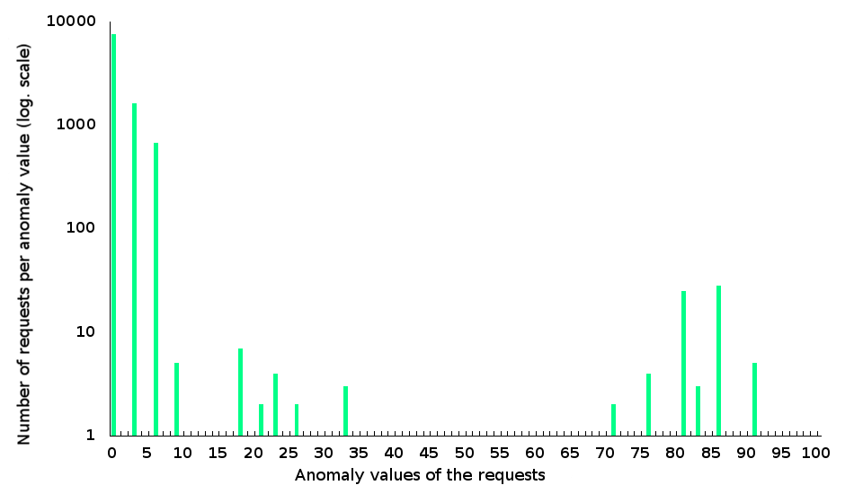

##Tutorial 8 - Fine tuning OWASP ModSecurity Core Rules

###What are we doing?

To successfully ward off attackers, we are reducing the number of *false positives* for a fresh installation of *OWASP ModSecurity Core Rules* and will then set the anomaly limits to a lower level.

###Why are we doing this?

A fresh installation of *core rules* will typically have a lot of false alarms. There can be thousands of them. In the last tutorial we saw a number of approaches for suppressing individual false alarms in the future. Knowing where to start can be difficult and what is missing is a strategy for coping with the sheer quantity of false alarms. Reducing the number of false alarms is the prerequisite for lowering the *core rules* anomaly limits and this in turn is required in order to use *ModSecurity* to actually ward off attackers. And only after the false alarms really are disabled or at least to a large extent curtailed do we get a picture of real attackers.

###Requirements

* An Apache web server, ideally one created using the file structure shown in [Tutorial 1 (Compiling an Apache web server)](https://www.netnea.com/cms/apache_tutorial_1_apache_compilieren/).
* Understanding of the minimal configuration in [Tutorial 2 (Configuring a minimal Apache server)](https://www.netnea.com/cms/apache_tutorial_2_apache_minimal_konfigurieren/).
* An Apache web server with SSL/TLS support as in [Tutorial 4 (Configuring an SSL server)](https://www.netnea.com/cms/apache-tutorial-4-ssl-server-konfigurieren)
* An Apache web server with extended access log as in [Tutorial 5 (Extending and analyzing the access log)](https://www.netnea.com/cms/apache-tutorial-5-zugriffslog-ausbauen/)
* An Apache web server with ModSecurity as in [Tutorial 6 (Embedding ModSecurity)](https://www.netnea.com/cms/apache-tutorial-6-modsecurity-einbinden/)
* An Apache web server with Core Rules installation as in [Tutorial 7 (Embedding Core Rules)](http://www.netnea.com/cms/modsecurity-core-rules-einbinden/)

It's also a good idea for us to have a real application to protect. In Tutorial 3 we saw how to set up a PHP application server. In a subsequent tutorial we will be setting up a reverse proxy or gateway server. Such an installation in productive use on the internet will then be accompanied by the desired quantity of *log file* entries and, with a high degree of probability, the large number of false alarms needed for this tutorial.

If data is unavailable or a working example is being sought for practice, it’s perhaps worthwhile to work with the existing practice data. I have prepared two *log files* as practice files. I say prepared, because they come from an untuned production system, which first had to be anonymized for use in practice by removing all data references to the original system. Furthermore, it had to be ensured that no real attacks are included in the log file, because we want to eliminate false alarms and not suppress the real alarms we need.

* [tutorial-8-example-access.log](./tutorial-8-example-access.log)
* [tutorial-8-example-error.log](./tutorial-8-example-error.log)

The log files are based on 10,000 requests. To me this seems to be the minimum needed for tuning. Smaller log files are in fact too random and only reflect one aspect of a service. The larger the basis for fine tuning, the better, but it's enough to start out with this size for the first fine tuning steps. Later on it may be a good idea to use to larger log files to get rid of false alarms that occur even less frequently.

###Step 1: Putting ModSecurity into blocking mode

In the previous tutorial I pointed out that we would only be fine tuning a blocking *Web Application Firewall*. In *ModSecurity*, monitoring is done in *monitoring mode*, individual false alarms are eliminated and despite these good intentions the administrator gives up in the end, with no clear objective in mind and overcome by the sheer quantity of false alarms.

Faced with this, I propose a clear approach:
* Put ModSecurity into blocking mode
* Set very high anomaly limits
* Fine tune relevant false alarms
* Slightly lower anomaly limits
* Fine tune the relevant false alarms
* ...
* Easily lower anomaly limits to a score such as 5 or 10
This is an iterative approach that always works in blocking mode and in a series of small steps achieves a gradual reduction in the number of false alarms. During this process, confidence grows in the system, the ability to reduce false alarms and your own fine tuning skills. If we work in *blocking mode* from the very beginning we don’t need be afraid of that big day we throw the lever over from *monitoring mode* to *blocking mode*. In reality, we are sharpening the WAF’s teeth with every interaction and if we do it right few if any legitimate requests will be blocked.

###Step 2: Excluding attack traffic from the log file

*ModSecurity* should help us differentiate between attackers and legitimate users; this is the real reason behind the many rules and tweaks to the system. It increases the level of separation. However, in order to perform this process we need, as previously mentioned, log files that have been cleaned up. But how do we get one, especially since on an untuned system the attackers are difficult to find among all the false alarms in the log files.

Several methods can be used:
* We work on a test system isolated from the internet before introducing the service online.
* We employ access protection and only take into account requests passing inspection.
* We expunge unknown IP addresses from the log file.

In practice, I use a combination of these methods. The country of origin for the IP addresses is a very suitable filter criterion for fine tuning, especially for local systems in a small country like Switzerland. I also often extract successful login attempts from the log file and use them to create a list of valid IP addresses which I can then use to prepare my log file and use as the basis for fine tuning.

However, these considerations digress from the actual topic of fine tuning. At least these sample log files are available for you to practice on.

###Step 3: Understanding the relationships between access and error logs

In the preceding tutorials we closely inspected the web server’s *access log* and *error log*. Let’s place them side-by-side:

```bash
192.168.146.78 CH - [2015-05-20 15:34:59.211464] "POST /EMail/MailHandler HTTP/1.1" 303 - \
"https://www.example.com/EMail/newMessage.aspx?msg=new" "Mozilla/5.0 (Windows NT 6.1; WOW64; \
Trident/7.0; rv:11.0) like Gecko" www.example.com 192.168.34.16 443 proxy-server - + "4a537de2.52283b4e6d77b" \
ViZDA6wxQzZrjCzQ-t8AAAAt TLSv1.2 ECDHE-RSA-AES128-SHA256 1796 4302 -% 1181278 14514 164330 149 18 0
``` 

This sample line from the *access log* logs a request. It is a post request for the mail handler resource. The referrer references a *newMessage.aspx* resource, which is an indication that our request may have to do with sending e-mail. The second-to-last value is *18* and indicates an anomaly value for the inbound request. (The response adds 0 points, at the very end). Our limit is still set extremely high, so this poses no risk. But because this is mature or filtered traffic, we already know that it’s a false alarm, which earned a total score of 18 points. What kind of false positives were there? Let’s have a look.

```bash
$> grep ViZDA6wxQzZrjCzQ-t8AAAAt tutorial-8-example-error.log
[2015-05-20 15:34:59.212369] [-:error] - - [client 192.168.146.78] ModSecurity: Warning. Pattern match \
"\\\\W{4,}" at ARGS:message. [file \
"/opt/modsecurity-rules/latest/base_rules/modsecurity_crs_40_generic_attacks.conf"] [line "37"] [id "960024"] \
[rev "2"] [msg "Meta-Character Anomaly Detection Alert - Repetative Non-Word Characters"] [data "..."] \
[hostname "www.example.com"] [uri "/EMail/MailHandler"] [unique_id "ViZDA6wxQzZrjCzQ-t8AAAAt"]
[2015-05-20 15:34:59.212639] [-:error] - - [client 192.168.146.78] ModSecurity: Warning. Pattern match \
"(?:\\\\bhttp\\\\/(?:0\\\\.9|1\\\\.[01])|<(?:html|meta)\\\\b)" at ARGS:message. [file \
"/opt/modsecurity-rules/latest/base_rules/modsecurity_crs_40_generic_attacks.conf"] [line "136"] [id "950911"] \
[rev "2"] [msg "HTTP Response Splitting Attack"] [data "..."] [hostname "www.example.com"] \
[uri "/EMail/MailHandler"] [unique_id "ViZDA6wxQzZrjCzQ-t8AAAAt"]
[2015-05-20 15:34:59.223143] [-:error] - - [client 192.168.146.78] ModSecurity: Warning. Pattern match \
"<(a|abbr|acronym|address|applet|area|audioscope|b|base|basefront|bdo|bgsound|big|blackface|blink|blockquote\
|body|bq|br|button|caption|center|cite|code|col|colgroup|comment|dd|del|dfn|dir|div|dl|dt|em|embed|fieldset\
|fn|font|form|frame|frameset|h1|head|h ..." at ARGS:message. [file \
"/opt/modsecurity-rules/latest/base_rules/modsecurity_crs_41_xss_attacks.conf"] [line "301"] [id "973300"] \
[rev "2"] [msg "Possible XSS Attack Detected - HTML Tag Handler"] [data "..."] [hostname "www.example.com"] \
[uri "/EMail/MailHandler"] [unique_id "ViZDA6wxQzZrjCzQ-t8AAAAt"]
[2015-05-20 15:34:59.225529] [-:error] - - [client 192.168.146.78] ModSecurity: Warning. Pattern match \
"<!(doctype|entity)" at ARGS:message. [file \
"/opt/modsecurity-rules/latest/base_rules/modsecurity_crs_41_xss_attacks.conf"] [line "464"] [id "973314"] \
[rev "2"] [msg "XSS Attack Detected"] [data "..."] [hostname "www.example.com"] [uri "/EMail/MailHandler"] \
[unique_id "ViZDA6wxQzZrjCzQ-t8AAAAt"]
``` 
We’ll take the unique *request ID* from the *access log* and use it to search for *false positives* in the *error log*. Four of them are found; although a bit confusing, but we know how to use the aliases available to us:

```bash
$> grep ViZDA6wxQzZrjCzQ-t8AAAAt tutorial-8-example-error.log | melidmsg
960024 Meta-Character Anomaly Detection Alert - Repetative Non-Word Characters
950911 HTTP Response Splitting Attack
973300 Possible XSS Attack Detected - HTML Tag Handler
973314 XSS Attack Detected
```

A perfect fit. Our job is to now determine the exact conditions for all of these false positives and to suppress them in the future. In the next step we’ll be getting an idea of this work.

###Step 4: Quantifying false positives and deriving an approach

We have already been introduced to the *modsec-positive-stats.rb* script. This is where we can finally put it to good use:

```bash
$> cat tutorial-8-example-access.log | alscores | modsec-positive-stats.rb 
INCOMING                     Num of req. | % of req. |  Sum of % | Missing %
Number of incoming req. (total) |  10000 | 100.0000% | 100.0000% |   0.0000%

Empty or miss. incoming score   |      0 |   0.0000% |   0.0000% | 100.0000%
Reqs with incoming score of   0 |   7586 |  75.8600% |  75.8600% |  24.1400%
Reqs with incoming score of   1 |      0 |   0.0000% |  75.8600% |  24.1400%
Reqs with incoming score of   2 |      0 |   0.0000% |  75.8600% |  24.1400%
Reqs with incoming score of   3 |   1638 |  16.3800% |  92.2400% |   7.7600%
Reqs with incoming score of   4 |      0 |   0.0000% |  92.2400% |   7.7600%
Reqs with incoming score of   5 |      0 |   0.0000% |  92.2400% |   7.7600%
Reqs with incoming score of   6 |    676 |   6.7600% |  99.0000% |   1.0000%
Reqs with incoming score of   7 |      0 |   0.0000% |  99.0000% |   1.0000%
Reqs with incoming score of   8 |      0 |   0.0000% |  99.0000% |   1.0000%
Reqs with incoming score of   9 |      5 |   0.0500% |  99.0500% |   0.9500%
Reqs with incoming score of  10 |      0 |   0.0000% |  99.0500% |   0.9500%
Reqs with incoming score of  11 |      1 |   0.0100% |  99.0600% |   0.9400%
Reqs with incoming score of  12 |      0 |   0.0000% |  99.0600% |   0.9400%
Reqs with incoming score of  13 |      0 |   0.0000% |  99.0600% |   0.9400%
Reqs with incoming score of  14 |      0 |   0.0000% |  99.0600% |   0.9400%
Reqs with incoming score of  15 |      0 |   0.0000% |  99.0600% |   0.9400%
Reqs with incoming score of  16 |      0 |   0.0000% |  99.0600% |   0.9400%
Reqs with incoming score of  17 |      0 |   0.0000% |  99.0600% |   0.9400%
Reqs with incoming score of  18 |      7 |   0.0699% |  99.1300% |   0.8700%
Reqs with incoming score of  19 |      0 |   0.0000% |  99.1300% |   0.8700%
Reqs with incoming score of  20 |      0 |   0.0000% |  99.1300% |   0.8700%
Reqs with incoming score of  21 |      2 |   0.0200% |  99.1499% |   0.8501%
Reqs with incoming score of  22 |      0 |   0.0000% |  99.1499% |   0.8501%
Reqs with incoming score of  23 |      4 |   0.0400% |  99.1900% |   0.8100%
Reqs with incoming score of  24 |      0 |   0.0000% |  99.1900% |   0.8100%
Reqs with incoming score of  25 |      0 |   0.0000% |  99.1900% |   0.8100%
Reqs with incoming score of  26 |      2 |   0.0200% |  99.2099% |   0.7901%
Reqs with incoming score of  27 |      0 |   0.0000% |  99.2099% |   0.7901%
Reqs with incoming score of  28 |      0 |   0.0000% |  99.2099% |   0.7901%
Reqs with incoming score of  29 |      0 |   0.0000% |  99.2099% |   0.7901%
Reqs with incoming score of  30 |      0 |   0.0000% |  99.2099% |   0.7901%
Reqs with incoming score of  31 |      0 |   0.0000% |  99.2099% |   0.7901%
Reqs with incoming score of  32 |      0 |   0.0000% |  99.2099% |   0.7901%
Reqs with incoming score of  33 |      3 |   0.0300% |  99.2400% |   0.7600%
Reqs with incoming score of  34 |      1 |   0.0100% |  99.2500% |   0.7500%
Reqs with incoming score of  35 |      0 |   0.0000% |  99.2500% |   0.7500%
Reqs with incoming score of  36 |      0 |   0.0000% |  99.2500% |   0.7500%
Reqs with incoming score of  37 |      0 |   0.0000% |  99.2500% |   0.7500%
Reqs with incoming score of  38 |      0 |   0.0000% |  99.2500% |   0.7500%
Reqs with incoming score of  39 |      0 |   0.0000% |  99.2500% |   0.7500%
Reqs with incoming score of  40 |      0 |   0.0000% |  99.2500% |   0.7500%
Reqs with incoming score of  41 |      0 |   0.0000% |  99.2500% |   0.7500%
Reqs with incoming score of  42 |      0 |   0.0000% |  99.2500% |   0.7500%
Reqs with incoming score of  43 |      1 |   0.0100% |  99.2600% |   0.7400%
Reqs with incoming score of  44 |      0 |   0.0000% |  99.2600% |   0.7400%
Reqs with incoming score of  45 |      0 |   0.0000% |  99.2600% |   0.7400%
Reqs with incoming score of  46 |      0 |   0.0000% |  99.2600% |   0.7400%
Reqs with incoming score of  47 |      0 |   0.0000% |  99.2600% |   0.7400%
Reqs with incoming score of  48 |      0 |   0.0000% |  99.2600% |   0.7400%
Reqs with incoming score of  49 |      0 |   0.0000% |  99.2600% |   0.7400%
Reqs with incoming score of  50 |      0 |   0.0000% |  99.2600% |   0.7400%
Reqs with incoming score of  51 |      0 |   0.0000% |  99.2600% |   0.7400%
Reqs with incoming score of  52 |      0 |   0.0000% |  99.2600% |   0.7400%
Reqs with incoming score of  53 |      0 |   0.0000% |  99.2600% |   0.7400%
Reqs with incoming score of  54 |      0 |   0.0000% |  99.2600% |   0.7400%
Reqs with incoming score of  55 |      0 |   0.0000% |  99.2600% |   0.7400%
Reqs with incoming score of  56 |      0 |   0.0000% |  99.2600% |   0.7400%
Reqs with incoming score of  57 |      0 |   0.0000% |  99.2600% |   0.7400%
Reqs with incoming score of  58 |      0 |   0.0000% |  99.2600% |   0.7400%
Reqs with incoming score of  59 |      1 |   0.0100% |  99.2700% |   0.7300%
Reqs with incoming score of  60 |      0 |   0.0000% |  99.2700% |   0.7300%
Reqs with incoming score of  61 |      0 |   0.0000% |  99.2700% |   0.7300%
Reqs with incoming score of  62 |      0 |   0.0000% |  99.2700% |   0.7300%
Reqs with incoming score of  63 |      0 |   0.0000% |  99.2700% |   0.7300%
Reqs with incoming score of  64 |      0 |   0.0000% |  99.2700% |   0.7300%
Reqs with incoming score of  65 |      0 |   0.0000% |  99.2700% |   0.7300%
Reqs with incoming score of  66 |      1 |   0.0100% |  99.2800% |   0.7200%
Reqs with incoming score of  67 |      0 |   0.0000% |  99.2800% |   0.7200%
Reqs with incoming score of  68 |      0 |   0.0000% |  99.2800% |   0.7200%
Reqs with incoming score of  69 |      1 |   0.0100% |  99.2900% |   0.7100%
Reqs with incoming score of  70 |      0 |   0.0000% |  99.2900% |   0.7100%
Reqs with incoming score of  71 |      2 |   0.0200% |  99.3100% |   0.6900%
Reqs with incoming score of  72 |      0 |   0.0000% |  99.3100% |   0.6900%
Reqs with incoming score of  73 |      1 |   0.0100% |  99.3200% |   0.6800%
Reqs with incoming score of  74 |      0 |   0.0000% |  99.3200% |   0.6800%
Reqs with incoming score of  75 |      0 |   0.0000% |  99.3200% |   0.6800%
Reqs with incoming score of  76 |      4 |   0.0400% |  99.3600% |   0.6400%
Reqs with incoming score of  77 |      0 |   0.0000% |  99.3600% |   0.6400%
Reqs with incoming score of  78 |      0 |   0.0000% |  99.3600% |   0.6400%
Reqs with incoming score of  79 |      1 |   0.0100% |  99.3700% |   0.6300%
Reqs with incoming score of  80 |      0 |   0.0000% |  99.3700% |   0.6300%
Reqs with incoming score of  81 |     25 |   0.2500% |  99.6200% |   0.3800%
Reqs with incoming score of  82 |      0 |   0.0000% |  99.6200% |   0.3800%
Reqs with incoming score of  83 |      3 |   0.0300% |  99.6500% |   0.3500%
Reqs with incoming score of  84 |      1 |   0.0100% |  99.6600% |   0.3400%
Reqs with incoming score of  85 |      0 |   0.0000% |  99.6600% |   0.3400%
Reqs with incoming score of  86 |     28 |   0.2799% |  99.9400% |   0.0600%
Reqs with incoming score of  87 |      0 |   0.0000% |  99.9400% |   0.0600%
Reqs with incoming score of  88 |      0 |   0.0000% |  99.9400% |   0.0600%
Reqs with incoming score of  89 |      1 |   0.0100% |  99.9500% |   0.0500%
Reqs with incoming score of  90 |      0 |   0.0000% |  99.9500% |   0.0500%
Reqs with incoming score of  91 |      5 |   0.0500% | 100.0000% |   0.0000%

Average:   1.5616        Median   0.0000         Standard deviation   7.3050


OUTGOING                     Num of req. | % of req. |  Sum of % | Missing %
Number of outgoing req. (total) |  10000 | 100.0000% | 100.0000% |   0.0000%

Empty or miss. outgoing score   |      0 |   0.0000% |   0.0000% | 100.0000%
Reqs with outgoing score of   0 |   9886 |  98.8600% |  98.8600% |   1.1400%
Reqs with outgoing score of   1 |      0 |   0.0000% |  98.8600% |   1.1400%
Reqs with outgoing score of   2 |      0 |   0.0000% |  98.8600% |   1.1400%
Reqs with outgoing score of   3 |    114 |   1.1400% | 100.0000% |   0.0000%

Average:   0.0342        Median   0.0000         Standard deviation   0.3185
```

Accordingly, of the 10,000 incoming requests, just under 2,500 requests violated one or more rules. Altogether, there are over 5,400 rule violations, which represent a large quantity when you consider that these are the violations we have to handle. At 114 times a score of 3, the responses look better, but the false positives on the request side are threatening to overwhelm us. What we need is a plan to make the problem manageable. Let’s start with a graphical representation of the statistics presented above. This isn‘t really necessary, but helps us in the following conceptual consideration:



I used a logarithmic scale to keep some of the smaller values for requests with no rule violations from disappearing entirely. On the x-axis we see the number of requests with a particular anomaly score. The weight clearly lies on the left, where over a thousand requests scored a 3 and then several hundred scored a 6, etc. The quantity of these requests may be upsetting at first, but in terms of the number of rule violations, a 3 can be scored by violating a single rule.

This looks different on the right side of the graph. Scoring a 90 means having to violate 15 to 20 rules. The number of overall requests is significantly lower here, but each of them violate a large number of rules.

If we look at the graph as a whole, then the left side dominates in terms of numbers. But in terms of the anomaly limits we want to lower, then the requests on the left bother us barely at all, while the false alarms appearing on the right will keep us from lowering the anomaly limit to a score below one hundred. Specifically: If we want to lower the limit to 90, we have to handle the five requests with an anomaly score of 91. If we want to get to 85 after that, then we have to handle the request with a score of 89 and the 28 requests that scored 86. Lowering it to 80 means considering the scores of 84, 83 and 81. And so on.

If we start on the right side of the graph, we can then work through the false alarms in manageable steps and see an immediate improvement which allows us to lower the anomaly limits.

This means that out of the big heap of data we have to handle five requests and will then be able to lower the anomaly limit immediately afterwards without having worry about legitimate users being blocked. In practice, I recommend exercising extreme caution at this stage (so, in our case, not something like an immediate reduction to 90, but perhaps to 100; a safety margin is a good idea). Even if some things are being blocked now and then, we can be certain that it won’t happen very often. Because the majority of requests being handled by the service will have significantly lower anomaly scores.

###Step 5: Determining the ModSec Core Rules violated and deriving ignore rules

Our management goal is the five requests with an anomaly score of 91. Which requests are they?

```bash
$> grep -E " 91 [0-9-]+$" tutorial-8-example-access.log
192.168.186.76 CH - [2015-05-22 09:25:35.064580] "POST /EMail/MailHandler HTTP/1.1" 303 - "https://www.example.com/EMail/newMessage.aspx?action=reply&mailId=3891_32&folderId=947_65&showPics=false" "Mozilla/5.0 (Windows NT 6.3; WOW64; Trident/7.0; rv:11.0) like Gecko" www.example.com 192.168.34.16 443 proxy-server - + "b49f5038.522aa9d333675" ViiPb6wxQzZrjBP3RHUAAAAs TLSv1.2 ECDHE-RSA-AES256-SHA384 7969 630 -% 1585494 309159 255001 491 91 0
192.168.186.76 CH - [2015-05-27 08:43:47.363527] "POST /EMail/MailHandler HTTP/1.1" 303 - "https://www.example.com/EMail/newMessage.aspx?action=reply&mailId=3904_9&folderId=947_65&showPics=false" "Mozilla/5.0 (Windows NT 6.3; WOW64; Trident/7.0; rv:11.0) like Gecko" www.example.com 192.168.34.16 443 proxy-server - + "8e2ac2ca.52310227db9e9" Vi8rM6wxQzZrjFeGPFsAAAAl TLSv1.2 ECDHE-RSA-AES256-SHA384 7985 630 -% 1413745 303533 90351 179 91 0
192.168.186.76 CH - [2015-05-29 15:24:59.946738] "POST /EMail/MailHandler HTTP/1.1" 303 - "https://www.example.com/EMail/newMessage.aspx?action=reply&mailId=3920_9&folderId=947_65&showPics=false" "Mozilla/5.0 (Windows NT 6.3; WOW64; Trident/7.0; rv:11.0) like Gecko" www.example.com 192.168.34.16 443 proxy-server - + "f139da27.52338400e3ec8" VjIsO6wxQzZrjAbVVkAAAABs TLSv1.2 ECDHE-RSA-AES256-SHA384 7831 630 -% 3678101 290095 368102 212 91 0
192.168.186.76 CH - [2015-05-30 09:52:00.029400] "POST /EMail/MailHandler HTTP/1.1" 303 - "https://www.example.com/EMail/newMessage.aspx?action=reply&mailId=3920_35&folderId=947_65&showPics=false" "Mozilla/5.0 (Windows NT 6.3; WOW64; Trident/7.0; rv:11.0) like Gecko" www.example.com 192.168.34.16 443 proxy-server - + "280bc544.5234c6c781c1a" VjMvsKwxQzZrjDjiL4UAAAAD TLSv1.2 ECDHE-RSA-AES256-SHA384 8972 4545 -% 1801042 444496 335489 173 91 0
192.168.186.76 CH - [2015-05-30 11:00:28.476417] "POST /EMail/MailHandler HTTP/1.1" 303 - "https://www.example.com/EMail/newMessage.aspx?action=reply&mailId=3923_2&folderId=947_65&showPics=false" "Mozilla/5.0 (Windows NT 6.3; WOW64; Trident/7.0; rv:11.0) like Gecko" www.example.com 192.168.34.16 443 proxy-server - + "280bc544.5234c6c781c1a" VjM-vKwxQzZrjDjiMJQAAAAW TLSv1.2 ECDHE-RSA-AES256-SHA384 8375 630 -% 1528716 365798 141645 295 91 0
```
These requests are clearly quite similar. It’s easy to conclude that all five of them violate the same rules. But which ones are they? To find out, let’s get the unique *request ID*:

```bash
$> grep -E " 91 [0-9-]+$" tutorial-8-example-access.log | alreqid 
ViiPb6wxQzZrjBP3RHUAAAAs
Vi8rM6wxQzZrjFeGPFsAAAAl
VjIsO6wxQzZrjAbVVkAAAABs
VjMvsKwxQzZrjDjiL4UAAAAD
VjM-vKwxQzZrjDjiMJQAAAAW
$> 
```

We now write these identifier keys to a file and use them to search the *error log* for matching rule violations, which we then immediately summarize in readable format.

```bash
$> grep -E " 91 [0-9-]+$" tutorial-8-example-access.log | alreqid > ids-score-91
$> grep -F -f ids-score-91 tutorial-8-example-error.log | melidmsg | sucs
      5 950911 HTTP Response Splitting Attack
      5 960024 Meta-Character Anomaly Detection Alert - Repetative Non-Word Characters
      5 973300 Possible XSS Attack Detected - HTML Tag Handler
      5 973304 XSS Attack Detected
      5 973306 XSS Attack Detected
      5 973314 XSS Attack Detected
      5 973316 IE XSS Filters - Attack Detected.
      5 973332 IE XSS Filters - Attack Detected.
      5 973333 IE XSS Filters - Attack Detected.
      5 973335 IE XSS Filters - Attack Detected.
      5 973338 XSS Filter - Category 3: Javascript URI Vector
      5 981172 Restricted SQL Character Anomaly Detection Alert - Total # of special characters exceeded
      5 981231 SQL Comment Sequence Detected.
      5 981243 Detects classic SQL injection probings 2/2
      5 981244 Detects basic SQL authentication bypass attempts 1/3
      5 981245 Detects basic SQL authentication bypass attempts 2/3
      5 981246 Detects basic SQL authentication bypass attempts 3/3
      5 981248 Detects chained SQL injection attempts 1/2
      5 981257 Detects MySQL comment-/space-obfuscated injections and backtick termination
```

Our suspicion has thus been confirmed: Each of these rules was violated exactly five times. So, there’s a high level of probability that we are dealing with five identical requests violating the same group of rules. It smells a lot like *cross-site scripting* attacks and an attempt at *SQL injection*. But we know that they are only false alarms. Where exactly did this occur?

```bash
$> grep -F -f ids-score-91 tutorial-8-example-error.log | melmatch | sucs
      5 REQUEST_COOKIES:X0_org
     90 ARGS:message
```

Interesting. The *message* parameter was the main contributor to the score of 91. Also, the request line of our five requests is `POST /EMail/MailHandler HTTP/1.1`, so this quickly makes it clear that we are dealing with content related to an e-mail being sent. It’s immediately obvious that we can expect to see many more false alarms from just this text field in our service. If we want to suppress the false alarms we have to disable the relevant *core rules* for precisely this path and this parameter. Mind you, this means that we are poking holes here and there into our firewall. Considering the more than 200 different core rules and the large overall numbers of *XSS* and *SQL injections*, these holes can be justified and are the prerequisite for being able to work with hard limits using the *core rules*.

We have became familiar with suppressing individual rules for one parameter on a specific path in the previous tutorial. Applied to our case, this results in the following *tuning rule* or *ignore rule* for the first rule violation:

```bash
SecRule REQUEST_FILENAME "@beginsWith /EMail/MailHandler" "phase:2,nolog,pass,t:none,id:10000,ctl:ruleRemoveTargetById=950911;ARGS:message"
```

Thus, one of the 20 rule infractions listed above has been handled. We proceed in a similar way with the other 19. But this entails a lot of manual labor, which is why we want to help ourselves to another script that takes over determining the fine tuning rule from us: [modsec-rulereport.rb](https://github.com/Apache-Labor/labor/blob/master/bin/modsec-rulereport.rb)

This script is able to read and interpret *ModSecurity* alerts. *-h* gives you an overview of the different ways it can be used. We are primarily interested in the script’s ability to independently generate the *ignore rules* we want, saving us a lot of effort. The variations of this rule we saw in the previous tutorial can be accessed in *path*, *parameter* and *combined* modes. There is no mode for the complicated scoring suppression rules. Here’s the script in action:

```bash
$> grep -F -f ids-score-91 tutorial-8-example-error.log | modsec-rulereport.rb --mode combined

5 x 950911 HTTP Response Splitting Attack (severity:  NONE/UNKOWN)
------------------------------------------------------------------
      # ModSec Rule Exclusion: 950911 : HTTP Response Splitting Attack (severity:  NONE/UNKOWN)
      SecRule REQUEST_FILENAME "@beginsWith /EMail/MailHandler" \
      	"phase:2,nolog,pass,id:10001,ctl:ruleRemoveTargetById=950911;ARGS:message"

5 x 960024 Meta-Character Anomaly Detection Alert - Repetative Non-Word Characters (severity:  NONE/UNKOWN)
-----------------------------------------------------------------------------------------------------------
      # ModSec Rule Exclusion: 960024 : Meta-Character Anomaly Detection Alert - ...
      SecRule REQUEST_FILENAME "@beginsWith /EMail/MailHandler" \
      	"phase:2,nolog,pass,id:10002,ctl:ruleRemoveTargetById=960024;ARGS:message"

5 x 973300 Possible XSS Attack Detected - HTML Tag Handler (severity:  NONE/UNKOWN)
-----------------------------------------------------------------------------------
      # ModSec Rule Exclusion: 973300 : Possible XSS Attack Detected - HTML Tag Handler ...
      SecRule REQUEST_FILENAME "@beginsWith /EMail/MailHandler" \
      	"phase:2,nolog,pass,id:10003,ctl:ruleRemoveTargetById=973300;ARGS:message"

5 x 973304 XSS Attack Detected (severity:  NONE/UNKOWN)
-------------------------------------------------------
      # ModSec Rule Exclusion: 973304 : XSS Attack Detected (severity:  NONE/UNKOWN)
      SecRule REQUEST_FILENAME "@beginsWith /EMail/MailHandler" \
      	"phase:2,nolog,pass,id:10004,ctl:ruleRemoveTargetById=973304;ARGS:message"

5 x 973306 XSS Attack Detected (severity:  NONE/UNKOWN)
-------------------------------------------------------
      # ModSec Rule Exclusion: 973306 : XSS Attack Detected (severity:  NONE/UNKOWN)
      SecRule REQUEST_FILENAME "@beginsWith /EMail/MailHandler" \
      	"phase:2,nolog,pass,id:10005,ctl:ruleRemoveTargetById=973306;ARGS:message"

5 x 973314 XSS Attack Detected (severity:  NONE/UNKOWN)
-------------------------------------------------------
      # ModSec Rule Exclusion: 973314 : XSS Attack Detected (severity:  NONE/UNKOWN)
      SecRule REQUEST_FILENAME "@beginsWith /EMail/MailHandler" \
      	"phase:2,nolog,pass,id:10006,ctl:ruleRemoveTargetById=973314;ARGS:message"

5 x 973316 IE XSS Filters - Attack Detected. (severity:  NONE/UNKOWN)
---------------------------------------------------------------------
      # ModSec Rule Exclusion: 973316 : IE XSS Filters - Attack Detected. (severity:  NONE/UNKOWN)
      SecRule REQUEST_FILENAME "@beginsWith /EMail/MailHandler" \
      	"phase:2,nolog,pass,id:10007,ctl:ruleRemoveTargetById=973316;ARGS:message"

5 x 973332 IE XSS Filters - Attack Detected. (severity:  NONE/UNKOWN)
---------------------------------------------------------------------
      # ModSec Rule Exclusion: 973332 : IE XSS Filters - Attack Detected. (severity:  NONE/UNKOWN)
      SecRule REQUEST_FILENAME "@beginsWith /EMail/MailHandler" \
      	"phase:2,nolog,pass,id:10008,ctl:ruleRemoveTargetById=973332;ARGS:message"

5 x 973333 IE XSS Filters - Attack Detected. (severity:  NONE/UNKOWN)
---------------------------------------------------------------------
      # ModSec Rule Exclusion: 973333 : IE XSS Filters - Attack Detected. (severity:  NONE/UNKOWN)
      SecRule REQUEST_FILENAME "@beginsWith /EMail/MailHandler" \
      	"phase:2,nolog,pass,id:10009,ctl:ruleRemoveTargetById=973333;ARGS:message"

5 x 973335 IE XSS Filters - Attack Detected. (severity:  NONE/UNKOWN)
---------------------------------------------------------------------
      # ModSec Rule Exclusion: 973335 : IE XSS Filters - Attack Detected. (severity:  NONE/UNKOWN)
      SecRule REQUEST_FILENAME "@beginsWith /EMail/MailHandler" \
      	"phase:2,nolog,pass,id:10010,ctl:ruleRemoveTargetById=973335;ARGS:message"

5 x 973338 XSS Filter - Category 3: Javascript URI Vector (severity:  NONE/UNKOWN)
----------------------------------------------------------------------------------
      # ModSec Rule Exclusion: 973338 : XSS Filter - Category 3: Javascript URI ...
      SecRule REQUEST_FILENAME "@beginsWith /EMail/MailHandler" \
      	"phase:2,nolog,pass,id:10011,ctl:ruleRemoveTargetById=973338;ARGS:message"

5 x 981172 Restricted SQL Character Anomaly Detection Alert - Total # of special characters exceeded (severity:  NONE/UNKOWN)
-----------------------------------------------------------------------------------------------------------------------------
      # ModSec Rule Exclusion: 981172 : Restricted SQL Character Anomaly Detection ...
      SecRule REQUEST_FILENAME "@beginsWith /EMail/MailHandler" \
      	"phase:2,nolog,pass,id:10012,ctl:ruleRemoveTargetById=981172;REQUEST_COOKIES:X0_org"

5 x 981231 SQL Comment Sequence Detected. (severity:  NONE/UNKOWN)
------------------------------------------------------------------
      # ModSec Rule Exclusion: 981231 : SQL Comment Sequence Detected. (severity:  NONE/UNKOWN)
      SecRule REQUEST_FILENAME "@beginsWith /EMail/MailHandler" \
      	"phase:2,nolog,pass,id:10013,ctl:ruleRemoveTargetById=981231;ARGS:message"

5 x 981243 Detects classic SQL injection probings 2/2 (severity:  NONE/UNKOWN)
------------------------------------------------------------------------------
      # ModSec Rule Exclusion: 981243 : Detects classic SQL injection probings 2/2 (severity:  NONE/UNKOWN)
      SecRule REQUEST_FILENAME "@beginsWith /EMail/MailHandler" \
      	"phase:2,nolog,pass,id:10014,ctl:ruleRemoveTargetById=981243;ARGS:message"

5 x 981244 Detects basic SQL authentication bypass attempts 1/3 (severity:  NONE/UNKOWN)
----------------------------------------------------------------------------------------
      # ModSec Rule Exclusion: 981244 : Detects basic SQL authentication bypass attempts 1/3 (severity:  NONE/UNKOWN)
      SecRule REQUEST_FILENAME "@beginsWith /EMail/MailHandler" \
      	"phase:2,nolog,pass,id:10015,ctl:ruleRemoveTargetById=981244;ARGS:message"

5 x 981245 Detects basic SQL authentication bypass attempts 2/3 (severity:  NONE/UNKOWN)
----------------------------------------------------------------------------------------
      # ModSec Rule Exclusion: 981245 : Detects basic SQL authentication bypass attempts 2/3 (severity:  NONE/UNKOWN)
      SecRule REQUEST_FILENAME "@beginsWith /EMail/MailHandler" \
      	"phase:2,nolog,pass,id:10016,ctl:ruleRemoveTargetById=981245;ARGS:message"

5 x 981246 Detects basic SQL authentication bypass attempts 3/3 (severity:  NONE/UNKOWN)
----------------------------------------------------------------------------------------
      # ModSec Rule Exclusion: 981246 : Detects basic SQL authentication bypass attempts 3/3 (severity:  NONE/UNKOWN)
      SecRule REQUEST_FILENAME "@beginsWith /EMail/MailHandler" \
      	"phase:2,nolog,pass,id:10017,ctl:ruleRemoveTargetById=981246;ARGS:message"

5 x 981248 Detects chained SQL injection attempts 1/2 (severity:  NONE/UNKOWN)
------------------------------------------------------------------------------
      # ModSec Rule Exclusion: 981248 : Detects chained SQL injection attempts 1/2 (severity:  NONE/UNKOWN)
      SecRule REQUEST_FILENAME "@beginsWith /EMail/MailHandler" \
      	"phase:2,nolog,pass,id:10018,ctl:ruleRemoveTargetById=981248;ARGS:message"

5 x 981257 Detects MySQL comment-/space-obfuscated injections and backtick termination (severity:  NONE/UNKOWN)
---------------------------------------------------------------------------------------------------------------
      # ModSec Rule Exclusion: 981257 : Detects MySQL comment-/space-obfuscated injections and backtick termination (severity:  NONE/UNKOWN)
      SecRule REQUEST_FILENAME "@beginsWith /EMail/MailHandler" \
      	"phase:2,nolog,pass,id:10019,ctl:ruleRemoveTargetById=981257;ARGS:message"
```

For each rule, the script lists the total number of rule violations and then proposes an *ignore rule* which can be included in the *Apache configuration*; only the *rule ID* for the *ignore rule* has to be modified. Next to one another, the rules are a bit hard to read, which is why I in practice I often summarize it by hand as you can see below. What’s important is to add comments to the rules, since the individual numbers don’t tell us much at all:

```bash
      # Ignore-Rules for ARGS:message 
      # -----------------------------
      # ModSec Rule Exclusion: 950911 : HTTP Response Splitting Attack (severity:  NONE/UNKOWN)
      # ModSec Rule Exclusion: 960024 : Meta-Character Anomaly Detection Alert - Repetative Non-Word Characters (severity:  NONE/UNKOWN)
      # ModSec Rule Exclusion: 973300 : Possible XSS Attack Detected - HTML Tag Handler (severity:  NONE/UNKOWN)
      # ModSec Rule Exclusion: 973304 : XSS Attack Detected (severity:  NONE/UNKOWN)
      # ModSec Rule Exclusion: 973306 : XSS Attack Detected (severity:  NONE/UNKOWN)
      # ModSec Rule Exclusion: 973314 : XSS Attack Detected (severity:  NONE/UNKOWN)
      # ModSec Rule Exclusion: 973316 : IE XSS Filters - Attack Detected. (severity:  NONE/UNKOWN)
      # ModSec Rule Exclusion: 973332 : IE XSS Filters - Attack Detected. (severity:  NONE/UNKOWN)
      # ModSec Rule Exclusion: 973333 : IE XSS Filters - Attack Detected. (severity:  NONE/UNKOWN)
      # ModSec Rule Exclusion: 973335 : IE XSS Filters - Attack Detected. (severity:  NONE/UNKOWN)
      # ModSec Rule Exclusion: 973338 : XSS Filter - Category 3: Javascript URI Vector (severity:  NONE/UNKOWN)
      # ModSec Rule Exclusion: 981231 : SQL Comment Sequence Detected. (severity:  NONE/UNKOWN)
      # ModSec Rule Exclusion: 981243 : Detects classic SQL injection probings 2/2 (severity:  NONE/UNKOWN)
      # ModSec Rule Exclusion: 981244 : Detects basic SQL authentication bypass attempts 1/3 (severity:  NONE/UNKOWN)
      # ModSec Rule Exclusion: 981245 : Detects basic SQL authentication bypass attempts 2/3 (severity:  NONE/UNKOWN)
      # ModSec Rule Exclusion: 981246 : Detects basic SQL authentication bypass attempts 3/3 (severity:  NONE/UNKOWN)
      # ModSec Rule Exclusion: 981248 : Detects chained SQL injection attempts 1/2 (severity:  NONE/UNKOWN)
      # ModSec Rule Exclusion: 981257 : Detects MySQL comment-/space-obfuscated injections and backtick termination (severity:  NONE/UNKOWN)
      SecRule REQUEST_FILENAME "@beginsWith /EMail/MailHandler" \
      	"phase:2,nolog,pass,id:10000,ctl:ruleRemoveTargetById=950911;ARGS:message,\
		ctl:ruleRemoveTargetById=960024;ARGS:message,ctl:ruleRemoveTargetById=973300;ARGS:message,\
		ctl:ruleRemoveTargetById=973304;ARGS:message,ctl:ruleRemoveTargetById=973306;ARGS:message,\
		ctl:ruleRemoveTargetById=973314;ARGS:message,ctl:ruleRemoveTargetById=973316;ARGS:message,\
		ctl:ruleRemoveTargetById=973332;ARGS:message,ctl:ruleRemoveTargetById=973333;ARGS:message,\
		ctl:ruleRemoveTargetById=973335;ARGS:message,ctl:ruleRemoveTargetById=973338;ARGS:message,\
		ctl:ruleRemoveTargetById=981231;ARGS:message,ctl:ruleRemoveTargetById=981243;ARGS:message,\
		ctl:ruleRemoveTargetById=981244;ARGS:message,ctl:ruleRemoveTargetById=981245;ARGS:message,\
		ctl:ruleRemoveTargetById=981246;ARGS:message,ctl:ruleRemoveTargetById=981248;ARGS:message,\
		ctl:ruleRemoveTargetById=981257;ARGS:message"
```

This is now a more compact and legible block of *ignore rules* associated with the same parameter on the same path. But our five requests with an anomaly score of 91 indicate another parameter being violated that we should not forget: REQUEST_COOKIES:X0_org. This shows the elegance of the approach being proposed. In addition to the five rule violations caused by this cookie, in total it is responsible for over 2,000 alarms, almost half of all rule violations.

```bash
$> cat tutorial-8-example-error.log | grep "REQUEST_COOKIES:X0_org" | melidmsg | sucs
   2113 981172 Restricted SQL Character Anomaly Detection Alert - Total # of special characters exceeded
```

This is typical, because a cookie is sent along with every request dependent on the *path parameter*. If a cookie has a score indicative of a *false positive* this quickly results in a high number of false alarms. It would now be interesting to check the content of the cookie, but all parameter content was lost when preparing the sample log file. At this point it should be noted that we are dealing with a cookie containing a `uuid` and the four hyphens in a `uuid` are already enough to set off a false alarm. But that’s only incidental. Let’s get to the *ignore rule*. The script `modsec-rulereport.rb` can also give us a recommendation here:

```bash
$> cat tutorial-8-example-error.log | grep "REQUEST_COOKIES:X0_org" | modsec-rulereport.rb --mode parameter

2113 x 981172 Restricted SQL Character Anomaly Detection Alert - Total # of special characters exceeded (severity:  NONE/UNKOWN)
--------------------------------------------------------------------------------------------------------------------------------
      # ModSec Rule Exclusion: 981172 : Restricted SQL Character Anomaly Detection Alert - Total # of special characters exceeded (severity:  NONE/UNKOWN)
      SecRuleUpdateTargetById 981172 "!REQUEST_COOKIES:X0_org"
```

We have thus handled the twenty different false alarms caused by the five requests with a anomaly score of 91. We used the ignore rules derived from them to handle far greater than half of the rule violations:

```bash
$> (cat tutorial-8-example-error.log | grep -E "950911|960024|973300|973304|973306|973314|973316\
|973332|973333|973335|973338|981231|981243|981244|981245|981246|981248|981257" \
| grep "ARGS:message"; cat tutorial-8-example-error.log | grep 981172 | grep REQUEST_COOKIES:X0_org) | wc -l
3415
```

###Step 6: Putting ignore rules into production and lowering anomaly limits

It would now be appropriate to put these few rules into production and monitor the system for a while. Does a reduction in the anomaly scores actually take place? Can we reduce the anomaly limits in good conscience? If both are true, then the limits could be lowered. We worked on requests with a score of 91. I recommend a basically conservative approach and would put the rules into production and then watch it for a week or two. If there are no unhappy surprises, then I would lower the limit to 100 or even down to 90. However, at the same time I would perform the next round of fine tuning and again handle the legitimate requests with the highest scores.

It is in fact very well possible for new, similar scores to show up. This is primarily due to the original sample not being large enough to really cover everything. This means that you simply have to fine tune. Using the same pattern again: The legitimate requests with the highest scores as the object of the round of fine tuning.

###Step 7: Repeating Steps 5 and 6

Successfully fine tuning the *ModSecurity Core Rules* entails iterative repetition of the steps: Inspect a group of legitimate requests, derive the *ignore rules* from them, put them into production, monitor and lower anomaly limits as required. What’s important is a systematic approach and a fixed interval, i.e. adding a new group of *ignore rules* every two weeks, watching them for a few days, then deriving new *ignore rules* and adding them along with a lower limit.

###Step 8: Deriving additional ignore rules (scores 50-89)

However, because we are working through this tutorial for practice and are not in a production environment, we won’t be putting the ready-made *ignore rules* on the server, but will instead practice writing these rules a bit. In this second round we’ll be tackling the requests with a score in the 50s to 80s. A sample log file from which the rules suppressed above have been filtered out will serve as the basis ([tutorial-8-example-error.log-step-7](https://raw.githubusercontent.com/Apache-Labor/labor/master/tutorial-8/labor-04-example-error.log-step-7)). There were very many rule violations from 50 to 89 in the original statistics, but it will appear that not many more are added to our existing rule violations. To avoid having to handle the same rule violations again and again, we suppress the combinations already handled using a somewhat demanding *one-liner*:

```bash
$> cat tutorial-8-example-access.log | grep -E "[5-8][0-9] [0-9-]$" | alreqid > ids
$> grep -F -f ids tutorial-8-example-error.log-step-7 | melidmsg | sucs
      1 973300 Possible XSS Attack Detected - HTML Tag Handler
      1 973304 XSS Attack Detected
      1 973338 XSS Filter - Category 3: Javascript URI Vector
      1 981245 Detects basic SQL authentication bypass attempts 2/3
      1 981249 Detects chained SQL injection attempts 2/2
      1 981317 SQL SELECT Statement Anomaly Detection Alert
      2 960024 Meta-Character Anomaly Detection Alert - Repetative Non-Word Characters
      5 981172 Restricted SQL Character Anomaly Detection Alert - Total # of special characters exceeded
$> grep -F -f ids tutorial-8-example-error.log | melmatch | sucs
      1 ARGS:message
      1 ARGS:subject
      1 TX:sqli_select_statement_count
      5 ARGS:attachInfo
      5 REQUEST_COOKIES:utag_main
```

*utag_main* indicates that we have another cookie here. We’ll handle that separately:

```bash
$> grep -F -f ids tutorial-8-example-error.log | grep -v -E "ARGS:message.*(950911|960024|973300|973304\
|973306|973314|973316|973332|973333|973335|973338|981231|981243|981244|981245|981246|981248|981257)" \
| grep -v -E "REQUEST_COOKIES:X0_org.*981172" | grep "REQUEST_COOKIES:utag_main" \
| modsec-rulereport.rb -m parameter
5 x 981172 Restricted SQL Character Anomaly Detection Alert - Total # of special characters exceeded (severity:  NONE/UNKOWN)
-----------------------------------------------------------------------------------------------------------------------------
      # ModSec Rule Exclusion: 981172 : Restricted SQL Character Anomaly Detection Alert - ...
      SecRuleUpdateTargetById 981172 "!REQUEST_COOKIES:utag_main"
```

The argument *attachInfo* violates multiple rules. We have *ignore rules* proposed to us and summarize them manually:

```bash
$> grep -F -f ids tutorial-8-example-error.log | grep -v -E "ARGS:message.*(950911|960024|973300|973304\
|973306|973314|973316|973332|973333|973335|973338|981231|981243|981244|981245|981246|981248|981257)" \
| grep -v -E "REQUEST_COOKIES:X0_org.*981172" | grep "ARGS:attachInfo" | modsec-rulereport.rb -m combined

1 x 960024 Meta-Character Anomaly Detection Alert - Repetative Non-Word Characters (severity:  NONE/UNKOWN)
-----------------------------------------------------------------------------------------------------------
      # ModSec Rule Exclusion: 960024 : Meta-Character Anomaly Detection Alert - Repetative Non-Word Characters (severity:  NONE/UNKOWN)
      SecRule REQUEST_FILENAME "@beginsWith /EMail/MailHandler" \
      	"phase:2,nolog,pass,id:10000,ctl:ruleRemoveTargetById=960024;ARGS:attachInfo"

1 x 973300 Possible XSS Attack Detected - HTML Tag Handler (severity:  NONE/UNKOWN)
-----------------------------------------------------------------------------------
      # ModSec Rule Exclusion: 973300 : Possible XSS Attack Detected - HTML Tag Handler (severity:  NONE/UNKOWN)
      SecRule REQUEST_FILENAME "@beginsWith /EMail/MailHandler" \
      	"phase:2,nolog,pass,id:10001,ctl:ruleRemoveTargetById=973300;ARGS:attachInfo"

1 x 973304 XSS Attack Detected (severity:  NONE/UNKOWN)
-------------------------------------------------------
      # ModSec Rule Exclusion: 973304 : XSS Attack Detected (severity:  NONE/UNKOWN)
      SecRule REQUEST_FILENAME "@beginsWith /EMail/MailHandler" \
      	"phase:2,nolog,pass,id:10002,ctl:ruleRemoveTargetById=973304;ARGS:attachInfo"

1 x 973338 XSS Filter - Category 3: Javascript URI Vector (severity:  NONE/UNKOWN)
----------------------------------------------------------------------------------
      # ModSec Rule Exclusion: 973338 : XSS Filter - Category 3: Javascript URI Vector (severity:  NONE/UNKOWN)
      SecRule REQUEST_FILENAME "@beginsWith /EMail/MailHandler" \
      	"phase:2,nolog,pass,id:10003,ctl:ruleRemoveTargetById=973338;ARGS:attachInfo"

1 x 981245 Detects basic SQL authentication bypass attempts 2/3 (severity:  NONE/UNKOWN)
----------------------------------------------------------------------------------------
      # ModSec Rule Exclusion: 981245 : Detects basic SQL authentication bypass attempts 2/3 (severity:  NONE/UNKOWN)
      SecRule REQUEST_FILENAME "@beginsWith /EMail/MailHandler" \
      	"phase:2,nolog,pass,id:10004,ctl:ruleRemoveTargetById=981245;ARGS:attachInfo"
```

Here’s a summary:


```bash
      # Ignore-Rules for ARGS:attachInfo 
      # --------------------------------
      # ModSec Rule Exclusion: 960024 : Meta-Character Anomaly Detection Alert - Repetative Non-Word Characters (severity:  NONE/UNKOWN)
      # ModSec Rule Exclusion: 973300 : Possible XSS Attack Detected - HTML Tag Handler (severity:  NONE/UNKOWN)
      # ModSec Rule Exclusion: 973304 : XSS Attack Detected (severity:  NONE/UNKOWN)
      # ModSec Rule Exclusion: 973338 : XSS Filter - Category 3: Javascript URI Vector (severity:  NONE/UNKOWN)
      # ModSec Rule Exclusion: 981245 : Detects basic SQL authentication bypass attempts 2/3 (severity:  NONE/UNKOWN)
      SecRule REQUEST_FILENAME "@beginsWith /EMail/MailHandler" "phase:2,nolog,pass,id:10003,\
      	ctl:ruleRemoveTargetById=960024;ARGS:attachInfo,ctl:ruleRemoveTargetById=973300;ARGS:attachInfo,\
	ctl:ruleRemoveTargetById=973304;ARGS:attachInfo,ctl:ruleRemoveTargetById=973338;ARGS:attachInfo,\
	ctl:ruleRemoveTargetById=981245;ARGS:attachInfo"

```
It’s important to select a new ID for these rules. By default, the script always starts its count at 10000. I manually set the ID to 10001 in this case.

There are still three individual rule violations to handle in our group:

```bash
$> grep -F -f ids tutorial-8-example-error.log | grep -v -E "ARGS:message.*(950911|960024|973300|973304|973306\
|973314|973316|973332|973333|973335|973338|981231|981243|981244|981245|981246|981248|981257)" \
| grep -v -E "REQUEST_COOKIES:X0_org.*981172" | grep -E "ARGS:(message|subject)" \
| modsec-rulereport.rb -m combined
1 x 960024 Meta-Character Anomaly Detection Alert - Repetative Non-Word Characters (severity:  NONE/UNKOWN)
-----------------------------------------------------------------------------------------------------------
      # ModSec Rule Exclusion: 960024 : Meta-Character Anomaly Detection Alert - Repetative Non-Word Characters (severity:  NONE/UNKOWN)
      SecRule REQUEST_FILENAME "@beginsWith /EMail/MailHandler" \
      	"phase:2,nolog,pass,id:10000,ctl:ruleRemoveTargetById=960024;ARGS:subject"

1 x 981249 Detects chained SQL injection attempts 2/2 (severity:  NONE/UNKOWN)
------------------------------------------------------------------------------
      # ModSec Rule Exclusion: 981249 : Detects chained SQL injection attempts 2/2 (severity:  NONE/UNKOWN)
      SecRule REQUEST_FILENAME "@beginsWith /EMail/MailHandler" \
      	"phase:2,nolog,pass,id:10001,ctl:ruleRemoveTargetById=981249;ARGS:message"
```

This draws attention to the *subject* text field, that you also fill in when writing an e-mail. Only one rule violation was found there. But we can assume that in general the same rules will be violated in this text field, e.g. *message* and the fact that this has not yet happened shows that our log file has not yet covered all of the possibilities. If we want to handle *subject* similar to *message*, then we can derive a block of *ignore rules* from the *message ignore rules*. But, before we do this, we add the new suppression rule for rule ID `981249` to the latter:

```bash
      # Ignore-Rules for ARGS:subject
      # -----------------------------
      # ModSec Rule Exclusion: 950911 : HTTP Response Splitting Attack (severity:  NONE/UNKOWN)
      # ModSec Rule Exclusion: 960024 : Meta-Character Anomaly Detection Alert - Repetative Non-Word Characters (severity:  NONE/UNKOWN)
      # ModSec Rule Exclusion: 973300 : Possible XSS Attack Detected - HTML Tag Handler (severity:  NONE/UNKOWN)
      # ModSec Rule Exclusion: 973304 : XSS Attack Detected (severity:  NONE/UNKOWN)
      # ModSec Rule Exclusion: 973306 : XSS Attack Detected (severity:  NONE/UNKOWN)
      # ModSec Rule Exclusion: 973314 : XSS Attack Detected (severity:  NONE/UNKOWN)
      # ModSec Rule Exclusion: 973316 : IE XSS Filters - Attack Detected. (severity:  NONE/UNKOWN)
      # ModSec Rule Exclusion: 973332 : IE XSS Filters - Attack Detected. (severity:  NONE/UNKOWN)
      # ModSec Rule Exclusion: 973333 : IE XSS Filters - Attack Detected. (severity:  NONE/UNKOWN)
      # ModSec Rule Exclusion: 973335 : IE XSS Filters - Attack Detected. (severity:  NONE/UNKOWN)
      # ModSec Rule Exclusion: 973338 : XSS Filter - Category 3: Javascript URI Vector (severity:  NONE/UNKOWN)
      # ModSec Rule Exclusion: 981231 : SQL Comment Sequence Detected. (severity:  NONE/UNKOWN)
      # ModSec Rule Exclusion: 981243 : Detects classic SQL injection probings 2/2 (severity:  NONE/UNKOWN)
      # ModSec Rule Exclusion: 981244 : Detects basic SQL authentication bypass attempts 1/3 (severity:  NONE/UNKOWN)
      # ModSec Rule Exclusion: 981245 : Detects basic SQL authentication bypass attempts 2/3 (severity:  NONE/UNKOWN)
      # ModSec Rule Exclusion: 981246 : Detects basic SQL authentication bypass attempts 3/3 (severity:  NONE/UNKOWN)
      # ModSec Rule Exclusion: 981248 : Detects chained SQL injection attempts 1/2 (severity:  NONE/UNKOWN)
      # ModSec Rule Exclusion: 981249 : Detects chained SQL injection attempts 2/2 (severity:  NONE/UNKOWN)
      # ModSec Rule Exclusion: 981257 : Detects MySQL comment-/space-obfuscated injections and backtick termination (severity:  NONE/UNKOWN)
      SecRule REQUEST_FILENAME "@beginsWith /EMail/MailHandler" \
      	"phase:2,nolog,pass,id:10001,ctl:ruleRemoveTargetById=950911;ARGS:subject,\
	ctl:ruleRemoveTargetById=960024;ARGS:subject,ctl:ruleRemoveTargetById=973300;ARGS:subject,\
	ctl:ruleRemoveTargetById=973304;ARGS:subject,ctl:ruleRemoveTargetById=973306;ARGS:subject,\
	ctl:ruleRemoveTargetById=973314;ARGS:subject,ctl:ruleRemoveTargetById=973316;ARGS:subject,\
	ctl:ruleRemoveTargetById=973332;ARGS:subject,ctl:ruleRemoveTargetById=973333;ARGS:subject,\
	ctl:ruleRemoveTargetById=973335;ARGS:subject,ctl:ruleRemoveTargetById=973338;ARGS:subject,\
	ctl:ruleRemoveTargetById=981231;ARGS:subject,ctl:ruleRemoveTargetById=981243;ARGS:subject,\
	ctl:ruleRemoveTargetById=981244;ARGS:subject,ctl:ruleRemoveTargetById=981245;ARGS:subject,\
	ctl:ruleRemoveTargetById=981246;ARGS:subject,ctl:ruleRemoveTargetById=981248;ARGS:subject,\
	ctl:ruleRemoveTargetById=981249;ARGS:subject,ctl:ruleRemoveTargetById=981257;ARGS:subject"
```
	
By doing so, we continue to keep *message* and *subject* separate. Readability would suffer if we were to mix the blocks of parameters.

What's left in our group of false alarms is the cryptic *TX:sqli_select_statement_count* argument. The complete error message looks like this:

```bash
[2015-05-26 22:13:36.867916] [-:error] - - [client 192.168.146.78] ModSecurity: Warning. Operator GE matched \
3 at TX:sqli_select_statement_count. [file \
"/opt/modsecurity-rules/latest/base_rules/modsecurity_crs_41_sql_injection_attacks.conf"] [line "108"] \
[id "981317"] [rev "2"] [msg "SQL SELECT Statement Anomaly Detection Alert"] [data "..."] \
[hostname "www.example.com"] [uri "/EMail/MailHandler"] [unique_id "Vi6XgKwxQzZrjFreMRsAAAB3"]
```

The engine counts out the *SQL statements*, saves them to an internal transaction variable and an alarm goes off when there are three or more. We are once more confronted by the path */EMail/MailHandler*. I suggest handling the internal variable like any other argument and disabling this counter (which by the way rarely applies) when writing e-mails:

```bash
      # Ignore-Rules for TX:sqli_select_statement_count (SQL Statement counter)
      # -----------------------------------------------------------------------
      # ModSec Rule Exclusion: 981317 : SQL SELECT Statement Anomaly Detection Alert (severity:  NONE/UNKOWN)
      SecRule REQUEST_FILENAME "@beginsWith /EMail/MailHandler" \
      	"phase:2,nolog,pass,id:10002,ctl:ruleRemoveTargetById=981317;TX:sqli_select_statement_count"
```

###Step 9: Deriving additional ignore rules (scores 10-49)

There are 21 requests in this group, but only a few are rule violations we are unfamiliar with. For this basic data, I have prepared ([tutorial-8-example-error.log-step-8](https://raw.githubusercontent.com/Apache-Labor/labor/master/tutorial-8/labor-04-example-error.log-step-8)). It is the original log file from which all of the rule violations suppressed above have been filtered out:

```bash
$> cat tutorial-8-example-access.log | grep -E "[1-4][0-9] [0-9-]$" | alreqid > ids
$> wc -l ids
21
$> grep -F -f ids tutorial-8-example-error.log-step-8 | melidmsg
960000 Attempted multipart/form-data bypass
$> grep -F -f ids tutorial-8-example-error.log-step-8 | melmatch 
FILES:upFile
```

We are slowly getting the impression that the further down we go, the easier fine tuning work is becoming: In this respectably large block of rule violations we actually have only one new false alarm to handle: A file upload violation. This can easily be derived with our script.

```bash
      # Ignore-Rules for FILES:upFile
      # -----------------------------
      # ModSec Rule Exclusion: 960000 : Attempted multipart/form-data bypass (severity:  NONE/UNKOWN)
      SecRule REQUEST_FILENAME "@beginsWith /EMail/MailHandler" \
      	"phase:2,nolog,pass,id:10004,ctl:ruleRemoveTargetById=960000;FILES:upFile"

```

###Step 10: Deriving additional ignore rules (scores 1-9)

In the last block of *ignore rules* (scores of 1 to and including 9) we have now a lot of rule violations in terms of numbers. But are these really new false alarms or will we be able to get off as easy as we did with scores 10 to 49? ([tutorial-8-example-error.log-step-9](https://raw.githubusercontent.com/Apache-Labor/labor/master/tutorial-8/labor-04-example-error.log-step-9)), expanded in the previous steps, will serve as the base data.

```bash
$> cat tutorial-8-example-access.log | grep -E " [1-9] [0-9-]$" | alreqid > ids
$> wc -l ids
2319 ids
$> grep -F -f ids tutorial-8-example-error.log-step-9 | melidmsg | sucs
    114 981000 Possibly malicious iframe tag in output
```

We are in fact getting off just as easy. There’s only one problem left and it appears to concern output, not input. We’ll stick to what we’ve used so far:

```bash
      # Ignore-Rules for RESPONSE_BODY
      # ------------------------------
      # ModSec Rule Exclusion: 981000 : Possibly malicious iframe tag in output (severity:  NONE/UNKOWN)
      SecRule REQUEST_FILENAME "@beginsWith /EMail/newMessage.aspx" \
      	"phase:2,nolog,pass,id:10005,ctl:ruleRemoveTargetById=981000;RESPONSE_BODY"
```

This brings us to the end. We have completed handling our inventory of 10000 requests and over 5000 false alarms. When we put these rules into production we can still expect to see a few new false positives. We can however be certain that they will only occur now and then. It would be too early to set a very low anomaly limit at this time. But a score of 5 or 10 on the production system I recommend can be achieved in a few reduction steps with shorter rounds of tuning done in between.

###Step 11: Summarizing all ignore rules

Let’s once again summarize the different rules for suppressing false alarms. The rules are organized into two blocks in the configuration: *ignore rules* before the *Core Rules Inclusion* as well as rules following the *Core Rules*. The *Include statement* itself is positioned between the two blocks. The rules and headings are now formatted for them to be easily added to a configuration as in Tutorial 6 or 7.

```bash
      # === ModSecurity Ignore Rules Before Core Rules Inclusion; order by id of ignored rule (ids: 10000-49999)

      # Ignore-Rules for ARGS:message 
      # -----------------------------
      # ModSec Rule Exclusion: 950911 : HTTP Response Splitting Attack (severity:  NONE/UNKOWN)
      # ModSec Rule Exclusion: 960024 : Meta-Character Anomaly Detection Alert - Repetative Non-Word Characters (severity:  NONE/UNKOWN)
      # ModSec Rule Exclusion: 973300 : Possible XSS Attack Detected - HTML Tag Handler (severity:  NONE/UNKOWN)
      # ModSec Rule Exclusion: 973304 : XSS Attack Detected (severity:  NONE/UNKOWN)
      # ModSec Rule Exclusion: 973306 : XSS Attack Detected (severity:  NONE/UNKOWN)
      # ModSec Rule Exclusion: 973314 : XSS Attack Detected (severity:  NONE/UNKOWN)
      # ModSec Rule Exclusion: 973316 : IE XSS Filters - Attack Detected. (severity:  NONE/UNKOWN)
      # ModSec Rule Exclusion: 973332 : IE XSS Filters - Attack Detected. (severity:  NONE/UNKOWN)
      # ModSec Rule Exclusion: 973333 : IE XSS Filters - Attack Detected. (severity:  NONE/UNKOWN)
      # ModSec Rule Exclusion: 973335 : IE XSS Filters - Attack Detected. (severity:  NONE/UNKOWN)
      # ModSec Rule Exclusion: 973338 : XSS Filter - Category 3: Javascript URI Vector (severity:  NONE/UNKOWN)
      # ModSec Rule Exclusion: 981231 : SQL Comment Sequence Detected. (severity:  NONE/UNKOWN)
      # ModSec Rule Exclusion: 981243 : Detects classic SQL injection probings 2/2 (severity:  NONE/UNKOWN)
      # ModSec Rule Exclusion: 981244 : Detects basic SQL authentication bypass attempts 1/3 (severity:  NONE/UNKOWN)
      # ModSec Rule Exclusion: 981245 : Detects basic SQL authentication bypass attempts 2/3 (severity:  NONE/UNKOWN)
      # ModSec Rule Exclusion: 981246 : Detects basic SQL authentication bypass attempts 3/3 (severity:  NONE/UNKOWN)
      # ModSec Rule Exclusion: 981248 : Detects chained SQL injection attempts 1/2 (severity:  NONE/UNKOWN)
      # ModSec Rule Exclusion: 981249 : Detects chained SQL injection attempts 2/2 (severity:  NONE/UNKOWN)
      # ModSec Rule Exclusion: 981257 : Detects MySQL comment-/space-obfuscated injections and backtick termination (severity:  NONE/UNKOWN)
      SecRule REQUEST_FILENAME "@beginsWith /EMail/MailHandler" "phase:2,nolog,pass,id:10000,ctl:ruleRemoveTargetById=950911;ARGS:message,ctl:ruleRemoveTargetById=960024;ARGS:message,ctl:ruleRemoveTargetById=973300;ARGS:message,ctl:ruleRemoveTargetById=973304;ARGS:message,ctl:ruleRemoveTargetById=973306;ARGS:message,ctl:ruleRemoveTargetById=973314;ARGS:message,ctl:ruleRemoveTargetById=973316;ARGS:message,ctl:ruleRemoveTargetById=973332;ARGS:message,ctl:ruleRemoveTargetById=973333;ARGS:message,ctl:ruleRemoveTargetById=973335;ARGS:message,ctl:ruleRemoveTargetById=973338;ARGS:message,ctl:ruleRemoveTargetById=981231;ARGS:message,ctl:ruleRemoveTargetById=981243;ARGS:message,ctl:ruleRemoveTargetById=981244;ARGS:message,ctl:ruleRemoveTargetById=981245;ARGS:message,ctl:ruleRemoveTargetById=981246;ARGS:message,ctl:ruleRemoveTargetById=981248;ARGS:message,ctl:ruleRemoveTargetById=981249;ARGS:message,ctl:ruleRemoveTargetById=981257;ARGS:message"

      # Ignore-Rules for ARGS:subject
      # -----------------------------
      # ModSec Rule Exclusion: 950911 : HTTP Response Splitting Attack (severity:  NONE/UNKOWN)
      # ModSec Rule Exclusion: 960024 : Meta-Character Anomaly Detection Alert - Repetative Non-Word Characters (severity:  NONE/UNKOWN)
      # ModSec Rule Exclusion: 973300 : Possible XSS Attack Detected - HTML Tag Handler (severity:  NONE/UNKOWN)
      # ModSec Rule Exclusion: 973304 : XSS Attack Detected (severity:  NONE/UNKOWN)
      # ModSec Rule Exclusion: 973306 : XSS Attack Detected (severity:  NONE/UNKOWN)
      # ModSec Rule Exclusion: 973314 : XSS Attack Detected (severity:  NONE/UNKOWN)
      # ModSec Rule Exclusion: 973316 : IE XSS Filters - Attack Detected. (severity:  NONE/UNKOWN)
      # ModSec Rule Exclusion: 973332 : IE XSS Filters - Attack Detected. (severity:  NONE/UNKOWN)
      # ModSec Rule Exclusion: 973333 : IE XSS Filters - Attack Detected. (severity:  NONE/UNKOWN)
      # ModSec Rule Exclusion: 973335 : IE XSS Filters - Attack Detected. (severity:  NONE/UNKOWN)
      # ModSec Rule Exclusion: 973338 : XSS Filter - Category 3: Javascript URI Vector (severity:  NONE/UNKOWN)
      # ModSec Rule Exclusion: 981231 : SQL Comment Sequence Detected. (severity:  NONE/UNKOWN)
      # ModSec Rule Exclusion: 981243 : Detects classic SQL injection probings 2/2 (severity:  NONE/UNKOWN)
      # ModSec Rule Exclusion: 981244 : Detects basic SQL authentication bypass attempts 1/3 (severity:  NONE/UNKOWN)
      # ModSec Rule Exclusion: 981245 : Detects basic SQL authentication bypass attempts 2/3 (severity:  NONE/UNKOWN)
      # ModSec Rule Exclusion: 981246 : Detects basic SQL authentication bypass attempts 3/3 (severity:  NONE/UNKOWN)
      # ModSec Rule Exclusion: 981248 : Detects chained SQL injection attempts 1/2 (severity:  NONE/UNKOWN)
      # ModSec Rule Exclusion: 981249 : Detects chained SQL injection attempts 2/2 (severity:  NONE/UNKOWN)
      # ModSec Rule Exclusion: 981257 : Detects MySQL comment-/space-obfuscated injections and backtick termination (severity:  NONE/UNKOWN)
      SecRule REQUEST_FILENAME "@beginsWith /EMail/MailHandler" "phase:2,nolog,pass,id:10001,ctl:ruleRemoveTargetById=950911;ARGS:subject,ctl:ruleRemoveTargetById=960024;ARGS:subject,ctl:ruleRemoveTargetById=973300;ARGS:subject,ctl:ruleRemoveTargetById=973304;ARGS:subject,ctl:ruleRemoveTargetById=973306;ARGS:subject,ctl:ruleRemoveTargetById=973314;ARGS:subject,ctl:ruleRemoveTargetById=973316;ARGS:subject,ctl:ruleRemoveTargetById=973332;ARGS:subject,ctl:ruleRemoveTargetById=973333;ARGS:subject,ctl:ruleRemoveTargetById=973335;ARGS:subject,ctl:ruleRemoveTargetById=973338;ARGS:subject,ctl:ruleRemoveTargetById=981231;ARGS:subject,ctl:ruleRemoveTargetById=981243;ARGS:subject,ctl:ruleRemoveTargetById=981244;ARGS:subject,ctl:ruleRemoveTargetById=981245;ARGS:subject,ctl:ruleRemoveTargetById=981246;ARGS:subject,ctl:ruleRemoveTargetById=981248;ARGS:subject,ctl:ruleRemoveTargetById=981249;ARGS:subject,ctl:ruleRemoveTargetById=981257;ARGS:subject"

      # Ignore-Rules for TX:sqli_select_statement_count (SQL Statement counter)
      # -----------------------------------------------------------------------
      # ModSec Rule Exclusion: 981317 : SQL SELECT Statement Anomaly Detection Alert (severity:  NONE/UNKOWN)
      SecRule REQUEST_FILENAME "@beginsWith /EMail/MailHandler" "phase:2,nolog,pass,id:10002,ctl:ruleRemoveTargetById=981317;TX:sqli_select_statement_count"
      
      # Ignore-Rules for ARGS:attachInfo 
      # --------------------------------
      # ModSec Rule Exclusion: 960024 : Meta-Character Anomaly Detection Alert - Repetative Non-Word Characters (severity:  NONE/UNKOWN)
      # ModSec Rule Exclusion: 973300 : Possible XSS Attack Detected - HTML Tag Handler (severity:  NONE/UNKOWN)
      # ModSec Rule Exclusion: 973304 : XSS Attack Detected (severity:  NONE/UNKOWN)
      # ModSec Rule Exclusion: 973338 : XSS Filter - Category 3: Javascript URI Vector (severity:  NONE/UNKOWN)
      # ModSec Rule Exclusion: 981245 : Detects basic SQL authentication bypass attempts 2/3 (severity:  NONE/UNKOWN)
      SecRule REQUEST_FILENAME "@beginsWith /EMail/MailHandler" "phase:2,nolog,pass,id:10003,ctl:ruleRemoveTargetById=960024;ARGS:attachInfo,ctl:ruleRemoveTargetById=973300;ARGS:attachInfo,ctl:ruleRemoveTargetById=973304;ARGS:attachInfo,ctl:ruleRemoveTargetById=973338;ARGS:attachInfo,ctl:ruleRemoveTargetById=981245;ARGS:attachInfo"

      # Ignore-Rules for FILES:upFile
      # -----------------------------
      # ModSec Rule Exclusion: 960000 : Attempted multipart/form-data bypass (severity:  NONE/UNKOWN)
      SecRule REQUEST_FILENAME "@beginsWith /EMail/MailHandler" "phase:2,nolog,pass,id:10004,ctl:ruleRemoveTargetById=960000;FILES:upFile"

      # Ignore-Rules for RESPONSE_BODY
      # ------------------------------
      # ModSec Rule Exclusion: 981000 : Possibly malicious iframe tag in output (severity:  NONE/UNKOWN)
      SecRule REQUEST_FILENAME "@beginsWith /EMail/newMessage.aspx" "phase:2,nolog,pass,id:10005,ctl:ruleRemoveTargetById=981000;RESPONSE_BODY"

      # === ModSecurity Core Rules Inclusion

      Include  /modsecurity-core-rules/*.conf

      # === ModSecurity Ignore Rules After Core Rules Inclusion; order by id of ignored rule (ids: 50000-59999)

      # ModSec Rule Exclusion: 981172 : Restricted SQL Character Anomaly Detection Alert - Total # of special characters exceeded (severity:  NONE/UNKOWN)
      SecRuleUpdateTargetById 981172 "!REQUEST_COOKIES:X0_org"

      # ModSec Rule Exclusion: 981172 : Restricted SQL Character Anomaly Detection Alert - Total # of special characters exceeded (severity:  NONE/UNKOWN)
      SecRuleUpdateTargetById 981172 "!REQUEST_COOKIES:utag_main"

```

###Goodie: Getting a quicker overview

When you first approach an untuned service a quick overview is the thing you want. It’s a good idea to have a look at the distribution of scores as described above. A good next step is to get a report of how exactly the *anomaly scores* occurred, such as an overview of the rule violations for each anomaly score. The following construct generates a report like this. On the first line we extract a list of anomaly scores from the incoming requests which actually appear in the log file. We then build a loop around these *scores*, read the *request ID* for each *score*, save it in the file `ids` and perform a short analysis for these *IDs* in the *error log*.

```bash
$> SCORES=$(cat tutorial-8-example-access.log | alscorein | sort -n | uniq | egrep -v -E "^0" | xargs)
$> echo $SCORES
3 6 9 11 18 21 23 26 33 34 43 59 66 69 71 73 76 79 81 83 84 86 89 91
$> for S in $SCORES; do echo "INCOMING SCORE $S"; grep -E " $S [0-9-]+$" tutorial-8-example-access.log \
| alreqid > ids; grep -F -f ids tutorial-8-example-error.log | melidmsg | sucs; echo ; done 
INCOMING SCORE 3
     40 981000 Possibly malicious iframe tag in output
   1598 981172 Restricted SQL Character Anomaly Detection Alert - Total # of special characters exceeded

INCOMING SCORE 6
     69 981000 Possibly malicious iframe tag in output
   1283 981172 Restricted SQL Character Anomaly Detection Alert - Total # of special characters exceeded

INCOMING SCORE 9
      5 981000 Possibly malicious iframe tag in output
     10 981172 Restricted SQL Character Anomaly Detection Alert - Total # of special characters exceeded

INCOMING SCORE 11
      1 960000 Attempted multipart/form-data bypass
      2 981172 Restricted SQL Character Anomaly Detection Alert - Total # of special characters exceeded

INCOMING SCORE 18
      7 950911 HTTP Response Splitting Attack
      7 960024 Meta-Character Anomaly Detection Alert - Repetative Non-Word Characters
      7 973300 Possible XSS Attack Detected - HTML Tag Handler
      7 973314 XSS Attack Detected

INCOMING SCORE 21
      2 950911 HTTP Response Splitting Attack
      2 960024 Meta-Character Anomaly Detection Alert - Repetative Non-Word Characters
      2 973300 Possible XSS Attack Detected - HTML Tag Handler
      2 973314 XSS Attack Detected
      2 981172 Restricted SQL Character Anomaly Detection Alert - Total # of special characters exceeded

INCOMING SCORE 23
      1 981245 Detects basic SQL authentication bypass attempts 2/3
      3 981231 SQL Comment Sequence Detected.
      4 950911 HTTP Response Splitting Attack
      4 960024 Meta-Character Anomaly Detection Alert - Repetative Non-Word Characters
      4 973300 Possible XSS Attack Detected - HTML Tag Handler
      4 973314 XSS Attack Detected

INCOMING SCORE 26
      1 981172 Restricted SQL Character Anomaly Detection Alert - Total # of special characters exceeded
      2 950911 HTTP Response Splitting Attack
      2 973300 Possible XSS Attack Detected - HTML Tag Handler
      2 973314 XSS Attack Detected
      2 981245 Detects basic SQL authentication bypass attempts 2/3
      3 960024 Meta-Character Anomaly Detection Alert - Repetative Non-Word Characters

INCOMING SCORE 33
      3 950911 HTTP Response Splitting Attack
      3 960024 Meta-Character Anomaly Detection Alert - Repetative Non-Word Characters
      3 973300 Possible XSS Attack Detected - HTML Tag Handler
      3 973314 XSS Attack Detected
      3 981243 Detects classic SQL injection probings 2/2
      3 981245 Detects basic SQL authentication bypass attempts 2/3
      3 981257 Detects MySQL comment-/space-obfuscated injections and backtick termination

INCOMING SCORE 34
      1 950911 HTTP Response Splitting Attack
      1 960024 Meta-Character Anomaly Detection Alert - Repetative Non-Word Characters
      1 973300 Possible XSS Attack Detected - HTML Tag Handler
      1 973333 IE XSS Filters - Attack Detected.
      1 981243 Detects classic SQL injection probings 2/2
      1 981245 Detects basic SQL authentication bypass attempts 2/3
      2 981172 Restricted SQL Character Anomaly Detection Alert - Total # of special characters exceeded

INCOMING SCORE 43
      1 950911 HTTP Response Splitting Attack
      1 960024 Meta-Character Anomaly Detection Alert - Repetative Non-Word Characters
      1 973300 Possible XSS Attack Detected - HTML Tag Handler
      1 973304 XSS Attack Detected
      1 973314 XSS Attack Detected
      1 973333 IE XSS Filters - Attack Detected.
      1 981243 Detects classic SQL injection probings 2/2
      1 981245 Detects basic SQL authentication bypass attempts 2/3
      1 981257 Detects MySQL comment-/space-obfuscated injections and backtick termination

INCOMING SCORE 59
      1 950911 HTTP Response Splitting Attack
      1 973333 IE XSS Filters - Attack Detected.
      1 973338 XSS Filter - Category 3: Javascript URI Vector
      1 981243 Detects classic SQL injection probings 2/2
      2 973300 Possible XSS Attack Detected - HTML Tag Handler
      2 973304 XSS Attack Detected
      2 981245 Detects basic SQL authentication bypass attempts 2/3
      3 960024 Meta-Character Anomaly Detection Alert - Repetative Non-Word Characters

INCOMING SCORE 66
      1 950911 HTTP Response Splitting Attack
      1 960024 Meta-Character Anomaly Detection Alert - Repetative Non-Word Characters
      1 973300 Possible XSS Attack Detected - HTML Tag Handler
      1 973304 XSS Attack Detected
      1 973306 XSS Attack Detected
      1 973314 XSS Attack Detected
      1 973333 IE XSS Filters - Attack Detected.
      1 973338 XSS Filter - Category 3: Javascript URI Vector
      1 981172 Restricted SQL Character Anomaly Detection Alert - Total # of special characters exceeded
      1 981231 SQL Comment Sequence Detected.
      1 981243 Detects classic SQL injection probings 2/2
      1 981244 Detects basic SQL authentication bypass attempts 1/3
      1 981245 Detects basic SQL authentication bypass attempts 2/3
      1 981248 Detects chained SQL injection attempts 1/2

INCOMING SCORE 69
      1 950911 HTTP Response Splitting Attack
      1 960024 Meta-Character Anomaly Detection Alert - Repetative Non-Word Characters
      1 973300 Possible XSS Attack Detected - HTML Tag Handler
      1 973306 XSS Attack Detected
      1 973333 IE XSS Filters - Attack Detected.
      1 973338 XSS Filter - Category 3: Javascript URI Vector
      1 981231 SQL Comment Sequence Detected.
      1 981243 Detects classic SQL injection probings 2/2
      1 981244 Detects basic SQL authentication bypass attempts 1/3
      1 981245 Detects basic SQL authentication bypass attempts 2/3
      1 981246 Detects basic SQL authentication bypass attempts 3/3
      1 981248 Detects chained SQL injection attempts 1/2
      1 981257 Detects MySQL comment-/space-obfuscated injections and backtick termination
      2 981172 Restricted SQL Character Anomaly Detection Alert - Total # of special characters exceeded

INCOMING SCORE 71
      1 981246 Detects basic SQL authentication bypass attempts 3/3
      1 981257 Detects MySQL comment-/space-obfuscated injections and backtick termination
      2 950911 HTTP Response Splitting Attack
      2 960024 Meta-Character Anomaly Detection Alert - Repetative Non-Word Characters
      2 973300 Possible XSS Attack Detected - HTML Tag Handler
      2 973304 XSS Attack Detected
      2 973306 XSS Attack Detected
      2 973314 XSS Attack Detected
      2 973333 IE XSS Filters - Attack Detected.
      2 973338 XSS Filter - Category 3: Javascript URI Vector
      2 981172 Restricted SQL Character Anomaly Detection Alert - Total # of special characters exceeded
      2 981231 SQL Comment Sequence Detected.
      2 981243 Detects classic SQL injection probings 2/2
      2 981244 Detects basic SQL authentication bypass attempts 1/3
      2 981245 Detects basic SQL authentication bypass attempts 2/3
      2 981248 Detects chained SQL injection attempts 1/2

INCOMING SCORE 73
      1 950911 HTTP Response Splitting Attack
      1 960024 Meta-Character Anomaly Detection Alert - Repetative Non-Word Characters
      1 973300 Possible XSS Attack Detected - HTML Tag Handler
      1 973304 XSS Attack Detected
      1 973306 XSS Attack Detected
      1 973314 XSS Attack Detected
      1 973333 IE XSS Filters - Attack Detected.
      1 973338 XSS Filter - Category 3: Javascript URI Vector
      1 981231 SQL Comment Sequence Detected.
      1 981243 Detects classic SQL injection probings 2/2
      1 981244 Detects basic SQL authentication bypass attempts 1/3
      1 981245 Detects basic SQL authentication bypass attempts 2/3
      1 981246 Detects basic SQL authentication bypass attempts 3/3
      1 981248 Detects chained SQL injection attempts 1/2
      1 981257 Detects MySQL comment-/space-obfuscated injections and backtick termination

INCOMING SCORE 76
      1 981246 Detects basic SQL authentication bypass attempts 3/3
      1 981257 Detects MySQL comment-/space-obfuscated injections and backtick termination
      3 973316 IE XSS Filters - Attack Detected.
      3 973335 IE XSS Filters - Attack Detected.
      4 950911 HTTP Response Splitting Attack
      4 960024 Meta-Character Anomaly Detection Alert - Repetative Non-Word Characters
      4 973300 Possible XSS Attack Detected - HTML Tag Handler
      4 973304 XSS Attack Detected
      4 973306 XSS Attack Detected
      4 973314 XSS Attack Detected
      4 973333 IE XSS Filters - Attack Detected.
      4 973338 XSS Filter - Category 3: Javascript URI Vector
      4 981172 Restricted SQL Character Anomaly Detection Alert - Total # of special characters exceeded
      4 981231 SQL Comment Sequence Detected.
      4 981243 Detects classic SQL injection probings 2/2
      4 981244 Detects basic SQL authentication bypass attempts 1/3
      4 981245 Detects basic SQL authentication bypass attempts 2/3
      4 981248 Detects chained SQL injection attempts 1/2

INCOMING SCORE 79
      1 950911 HTTP Response Splitting Attack
      1 960024 Meta-Character Anomaly Detection Alert - Repetative Non-Word Characters
      1 973300 Possible XSS Attack Detected - HTML Tag Handler
      1 973304 XSS Attack Detected
      1 973306 XSS Attack Detected
      1 973314 XSS Attack Detected
      1 973333 IE XSS Filters - Attack Detected.
      1 973338 XSS Filter - Category 3: Javascript URI Vector
      1 981231 SQL Comment Sequence Detected.
      1 981243 Detects classic SQL injection probings 2/2
      1 981244 Detects basic SQL authentication bypass attempts 1/3
      1 981245 Detects basic SQL authentication bypass attempts 2/3
      1 981246 Detects basic SQL authentication bypass attempts 3/3
      1 981248 Detects chained SQL injection attempts 1/2
      1 981257 Detects MySQL comment-/space-obfuscated injections and backtick termination
      2 981172 Restricted SQL Character Anomaly Detection Alert - Total # of special characters exceeded

INCOMING SCORE 81
      1 973332 IE XSS Filters - Attack Detected.
      7 981246 Detects basic SQL authentication bypass attempts 3/3
     19 981257 Detects MySQL comment-/space-obfuscated injections and backtick termination
     24 973316 IE XSS Filters - Attack Detected.
     24 973335 IE XSS Filters - Attack Detected.
     25 950911 HTTP Response Splitting Attack
     25 960024 Meta-Character Anomaly Detection Alert - Repetative Non-Word Characters
     25 973300 Possible XSS Attack Detected - HTML Tag Handler
     25 973304 XSS Attack Detected
     25 973306 XSS Attack Detected
     25 973314 XSS Attack Detected
     25 973333 IE XSS Filters - Attack Detected.
     25 973338 XSS Filter - Category 3: Javascript URI Vector
     25 981172 Restricted SQL Character Anomaly Detection Alert - Total # of special characters exceeded
     25 981231 SQL Comment Sequence Detected.
     25 981243 Detects classic SQL injection probings 2/2
     25 981244 Detects basic SQL authentication bypass attempts 1/3
     25 981245 Detects basic SQL authentication bypass attempts 2/3
     25 981248 Detects chained SQL injection attempts 1/2

INCOMING SCORE 83
      3 950911 HTTP Response Splitting Attack
      3 960024 Meta-Character Anomaly Detection Alert - Repetative Non-Word Characters
      3 973300 Possible XSS Attack Detected - HTML Tag Handler
      3 973304 XSS Attack Detected
      3 973306 XSS Attack Detected
      3 973314 XSS Attack Detected
      3 973316 IE XSS Filters - Attack Detected.
      3 973333 IE XSS Filters - Attack Detected.
      3 973335 IE XSS Filters - Attack Detected.
      3 973338 XSS Filter - Category 3: Javascript URI Vector
      3 981231 SQL Comment Sequence Detected.
      3 981243 Detects classic SQL injection probings 2/2
      3 981244 Detects basic SQL authentication bypass attempts 1/3
      3 981245 Detects basic SQL authentication bypass attempts 2/3
      3 981246 Detects basic SQL authentication bypass attempts 3/3
      3 981248 Detects chained SQL injection attempts 1/2
      3 981257 Detects MySQL comment-/space-obfuscated injections and backtick termination

INCOMING SCORE 84
      1 950911 HTTP Response Splitting Attack
      1 960024 Meta-Character Anomaly Detection Alert - Repetative Non-Word Characters
      1 973300 Possible XSS Attack Detected - HTML Tag Handler
      1 973304 XSS Attack Detected
      1 973306 XSS Attack Detected
      1 973314 XSS Attack Detected
      1 973332 IE XSS Filters - Attack Detected.
      1 973333 IE XSS Filters - Attack Detected.
      1 973338 XSS Filter - Category 3: Javascript URI Vector
      1 981231 SQL Comment Sequence Detected.
      1 981243 Detects classic SQL injection probings 2/2
      1 981244 Detects basic SQL authentication bypass attempts 1/3
      1 981245 Detects basic SQL authentication bypass attempts 2/3
      1 981246 Detects basic SQL authentication bypass attempts 3/3
      1 981248 Detects chained SQL injection attempts 1/2
      1 981257 Detects MySQL comment-/space-obfuscated injections and backtick termination
      2 981172 Restricted SQL Character Anomaly Detection Alert - Total # of special characters exceeded

INCOMING SCORE 86
      1 981249 Detects chained SQL injection attempts 2/2
      1 981317 SQL SELECT Statement Anomaly Detection Alert
      2 973332 IE XSS Filters - Attack Detected.
     26 981246 Detects basic SQL authentication bypass attempts 3/3
     27 981172 Restricted SQL Character Anomaly Detection Alert - Total # of special characters exceeded
     27 981257 Detects MySQL comment-/space-obfuscated injections and backtick termination
     28 950911 HTTP Response Splitting Attack
     28 960024 Meta-Character Anomaly Detection Alert - Repetative Non-Word Characters
     28 973300 Possible XSS Attack Detected - HTML Tag Handler
     28 973304 XSS Attack Detected
     28 973306 XSS Attack Detected
     28 973314 XSS Attack Detected
     28 973316 IE XSS Filters - Attack Detected.
     28 973333 IE XSS Filters - Attack Detected.
     28 973335 IE XSS Filters - Attack Detected.
     28 973338 XSS Filter - Category 3: Javascript URI Vector
     28 981231 SQL Comment Sequence Detected.
     28 981243 Detects classic SQL injection probings 2/2
     28 981244 Detects basic SQL authentication bypass attempts 1/3
     28 981245 Detects basic SQL authentication bypass attempts 2/3
     28 981248 Detects chained SQL injection attempts 1/2

INCOMING SCORE 89
      1 950911 HTTP Response Splitting Attack
      1 960024 Meta-Character Anomaly Detection Alert - Repetative Non-Word Characters
      1 973300 Possible XSS Attack Detected - HTML Tag Handler
      1 973304 XSS Attack Detected
      1 973306 XSS Attack Detected
      1 973314 XSS Attack Detected
      1 973316 IE XSS Filters - Attack Detected.
      1 973333 IE XSS Filters - Attack Detected.
      1 973335 IE XSS Filters - Attack Detected.
      1 973338 XSS Filter - Category 3: Javascript URI Vector
      1 981231 SQL Comment Sequence Detected.
      1 981243 Detects classic SQL injection probings 2/2
      1 981244 Detects basic SQL authentication bypass attempts 1/3
      1 981245 Detects basic SQL authentication bypass attempts 2/3
      1 981246 Detects basic SQL authentication bypass attempts 3/3
      1 981248 Detects chained SQL injection attempts 1/2
      1 981257 Detects MySQL comment-/space-obfuscated injections and backtick termination
      2 981172 Restricted SQL Character Anomaly Detection Alert - Total # of special characters exceeded

INCOMING SCORE 91
      5 950911 HTTP Response Splitting Attack
      5 960024 Meta-Character Anomaly Detection Alert - Repetative Non-Word Characters
      5 973300 Possible XSS Attack Detected - HTML Tag Handler
      5 973304 XSS Attack Detected
      5 973306 XSS Attack Detected
      5 973314 XSS Attack Detected
      5 973316 IE XSS Filters - Attack Detected.
      5 973332 IE XSS Filters - Attack Detected.
      5 973333 IE XSS Filters - Attack Detected.
      5 973335 IE XSS Filters - Attack Detected.
      5 973338 XSS Filter - Category 3: Javascript URI Vector
      5 981172 Restricted SQL Character Anomaly Detection Alert - Total # of special characters exceeded
      5 981231 SQL Comment Sequence Detected.
      5 981243 Detects classic SQL injection probings 2/2
      5 981244 Detects basic SQL authentication bypass attempts 1/3
      5 981245 Detects basic SQL authentication bypass attempts 2/3
      5 981246 Detects basic SQL authentication bypass attempts 3/3
      5 981248 Detects chained SQL injection attempts 1/2
      5 981257 Detects MySQL comment-/space-obfuscated injections and backtick termination
```

Strictly speaking, the responses to the requests are also listed for the low *scores* along with the error messages; in cases where they were triggered on requests they encountered rule violations in the requests themselves. However, this detail does not make the construct above any less useful. A similar script that has been slight extended is part of my toolbox.

We have now reached the end of the block consisting of three *ModSecurity tutorials*. We will now be turning to how a *reverse proxy* is set up.

###References
- <a href="http://blog.spiderlabs.com/2011/08/modsecurity-advanced-topic-of-the-week-exception-handling.html">Spider Labs Blog Post: Exception Handling

### License / Copying / Further use

<a rel="license" href="http://creativecommons.org/licenses/by-nc-sa/4.0/"></a><br />This work is licensed under a <a rel="license" href="http://creativecommons.org/licenses/by-nc-sa/4.0/">Creative Commons Attribution-NonCommercial-ShareAlike 4.0 International License</a>.
